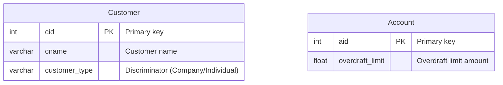
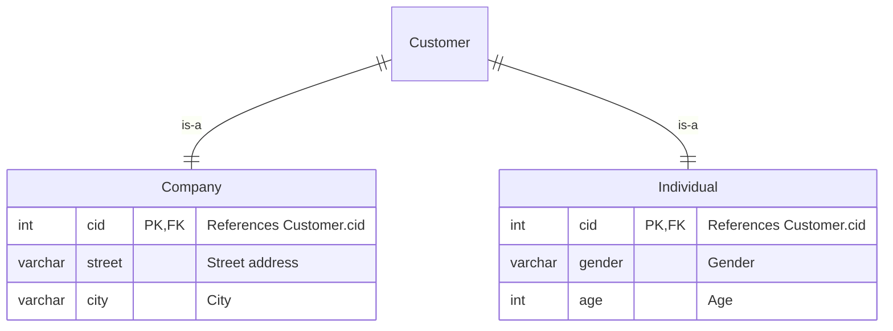
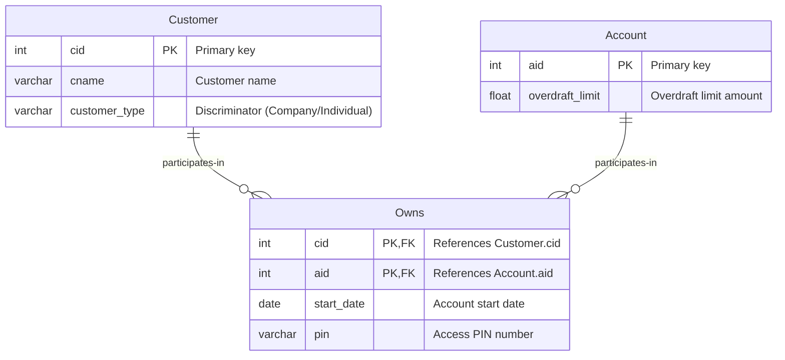
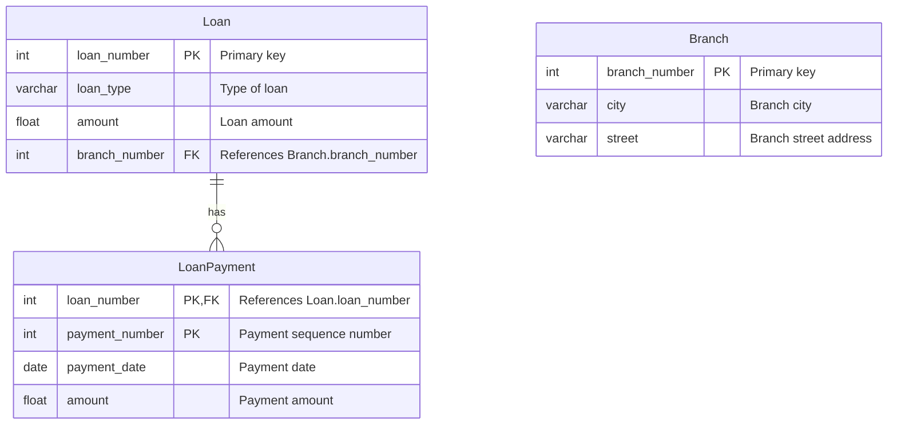
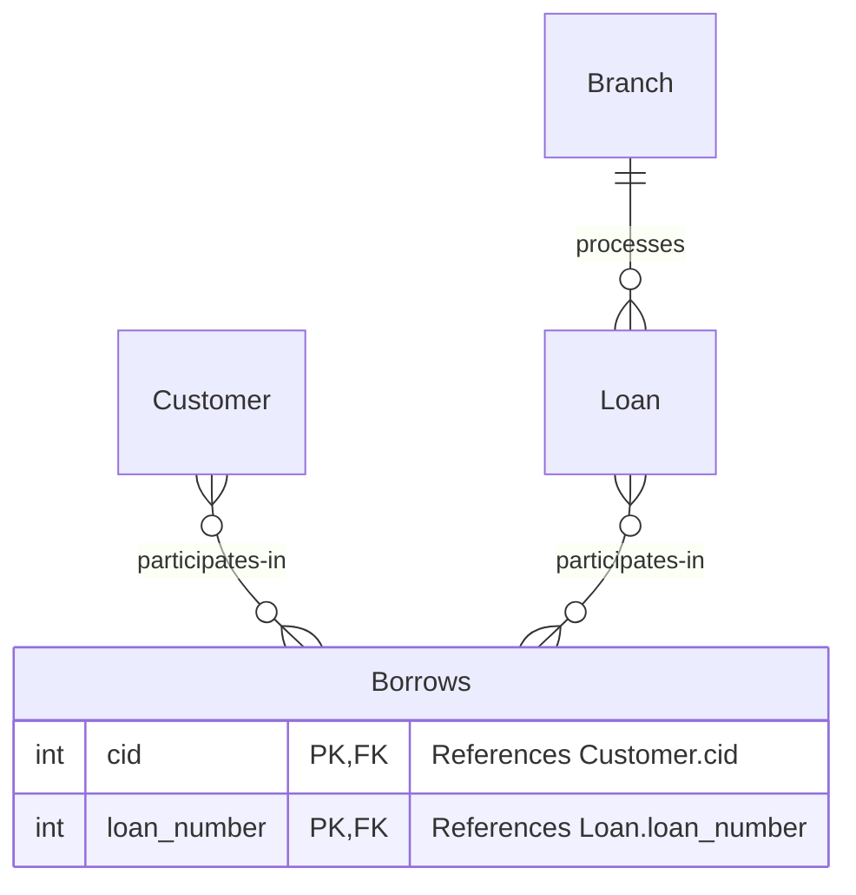
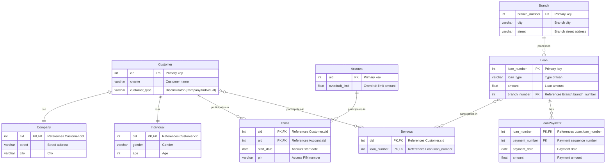

# Part 1：ER 建模

## 1. 客户和账户基本信息（第1个需求，8分）

解释：
- `Customer`实体存储客户信息，主键是`cid`（客户ID），包含`cname`（客户名称）属性
- `Account`实体存储账户信息，主键是`aid`（账户ID），包含`overdraft_limit`（透支限额）属性
- `customer_type`是区分器，用于标识客户是公司还是个人
  
## 2. 客户类型继承关系（第2个需求，10分）

解释：
- 使用`ISA`继承关系实现客户分类
- `Company`（公司客户）子类型包含`street`（街道）和`city`（城市）属性
- `Individual`（个人客户）子类型包含`gender`（性别）和`age`（年龄）属性
- 两个子类型都通过cid作为主键和外键，引用父类`Customer`

## 3. 客户拥有账户关系（第3个需求，7分）

解释：
- `Owns`是关联实体，表示客户与账户的拥有关系
- 包含关系属性：`start_date`（开户日期）和`pin`（个人识别码）
- 实现了一对多关系：一个客户可以拥有多个账户（`||--o{`），但一个账户只能被一个客户拥有
- 复合主键：`(cid, aid)`确保关系唯一性

## 4. 贷款相关实体（第4个需求，15分）

解释：
- `Loan`（贷款）：主键是`loan_number`，包含`loan_type`（贷款类型）和`amount`（金额）
- `LoanPayment`（贷款还款）：
    - 复合主键：`(loan_number, payment_number)`
    - 这确保了每笔贷款的还款编号唯一，但不同贷款可以有相同编号的还款
    - 包含`payment_date`（还款日期）和`amount`（还款金额）      

- `Branch`（分行）：主键是`branch_number`，包含`city`和`street`属性
- 一笔贷款可以有多次还款（一对多关系）

## 5. 贷款业务关系（第5个需求，8分）

解释：
- `Borrows`是关联实体，实现客户与贷款的多对多关系
- 一个客户可以有多笔贷款，一笔贷款可以有多个客户（如夫妻共同贷款）
- 每笔贷款在唯一的分行办理（`Branch ||--o{ Loan`，一对多关系）

关键设计决策和假设
1. 继承实现方式
- 采用单表继承策略，使用`customer_type`作为区分器
- `Company`和`Individual`作为`Customer`的子类型，共享`cid`

2. 关系属性处理
将带属性的关系（`Owns`、`Borrows`）转换为关联实体
这样可以存储关系的附加信息（如开户日期、`PIN`码）

3. 主键设计
- 复合主键用于：
    - `Owns (cid, aid)`：确保客户-账户关系唯一
    - `LoanPayment (loan_number, payment_number)`：实现还款编号的局部唯一性
    - `Borrows (cid, loan_number)`：确保借贷关系唯一

4. 参照完整性
- 所有外键都明确标注，确保数据一致性
- 子类型通过外键引用父类，保证ISA关系的完整性

**模型优点:**
- 清晰的层次结构：通过ISA关系明确表达客户类型
- 灵活的关系建模：使用关联实体处理复杂关系
- 数据完整性：通过主外键约束保证引用完整性
- 扩展性好：易于添加新的客户类型或账户类型

## Part 1 ALL Code
