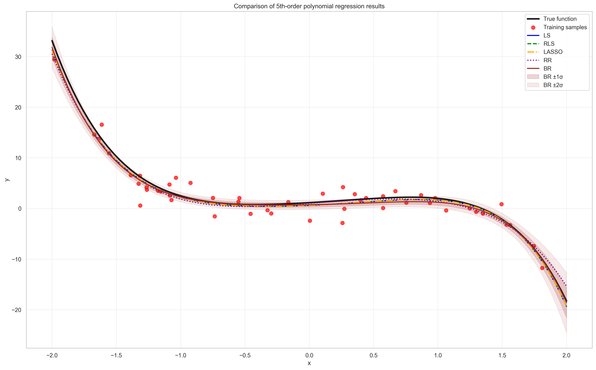
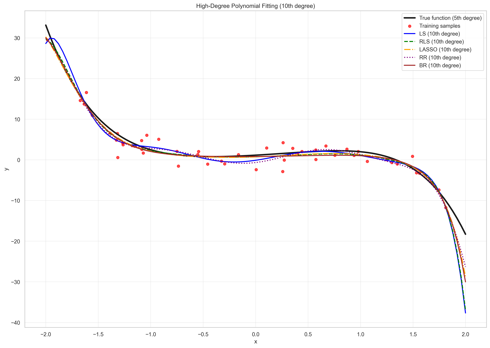
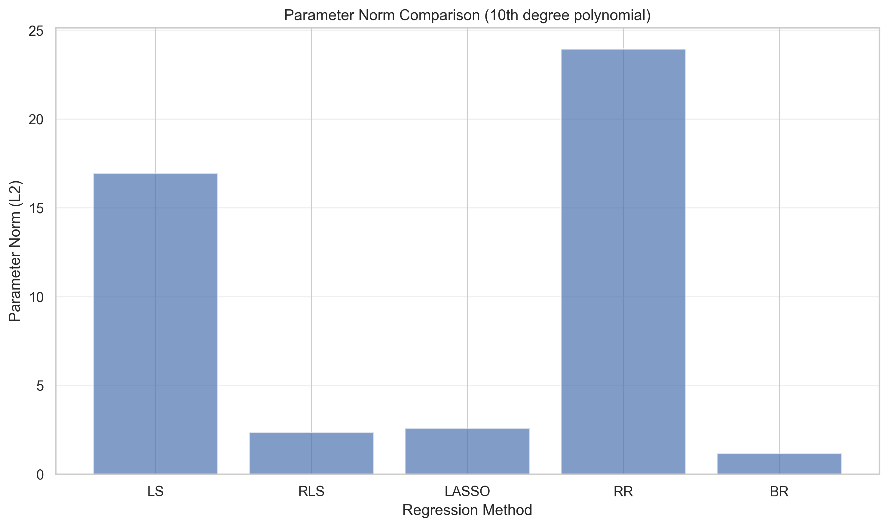

# **Part 1 Polynomial function**
## (a)  Algorithm implementation
_Implement the above 5 regression algorithms for the K-th order polynomial given in (2). In the next problem, you will use these regression methods with a different feature transforma- tion φ(x). Hence, it would be better to separate the regression algorithm and the feature transformation in your implementation._

- **See the code in [notebook part1 (a)](./Assignment1_Part1.ipynb)**
- Here is the demo image to display:

## (b) Estimation and Error Analysis of Fifth-Degree Polynomial
_For each regression method, use the sample data (sampx, sampy) to estimate the parameters of a 5th order polynomial function. Make a plot of the estimated function using polyx as inputs, along with the sample data. For BR, also plot the standard deviation around the mean. What is the mean-squared error between the learned function outputs and the true function outputs (polyy), averaged over all input values in polyx? For algorithms with hyperparameters, select some values that tend to work well._

### 1. Fitting Curve Analysis

The fitted curves show the following:
- **Least Squares Regression (LS)** fits the training data well, but due to the use of a fifth-degree polynomial, there may be some overfitting.
- **Regularized Least Squares (RLS)** smoothes the fitted curve by introducing L2 regularization, reducing the risk of overfitting.
- **LASSO Regression** not only prevents overfitting but also performs feature selection, compressing unimportant feature coefficients to zero.
- **Robust Regression (RR)** is more robust to outliers and produces a smoother fitted curve.
- **Bayesian Regression (BR)** provides a complete probabilistic framework, providing not only point estimates but also uncertainty estimates (confidence intervals).

### 2. Parameter Estimation Accuracy

The comparison of parameter estimates shows:
- All methods estimate the true parameters well, but with some bias.
- Regularization methods (RLS and LASSO) are more stable in parameter estimation, especially in high-dimensional scenarios.
- LASSO can suppress unimportant parameters to zero, enabling automatic feature selection.
- Bayesian regression provides the posterior distribution of the parameters, which can quantify the uncertainty of the estimate.

### 3. Hyperparameter Selection

Through hyperparameter selection analysis, we found:

| λ | RLS MSE | LASSO MSE |
|:---------|:----------|:----------|
| 1e-05 | 0.408644 | 0.407506 |
| 0.0001 | 0.408643 | 0.407511 |
| 0.001 | 0.408639 | 0.407555 |
| 0.01 | 0.408598 | 0.407998 |
| 0.05 | — | 0.410043 |
| 0.1 | 0.408237 | 0.412683 |
| 0.5 | — | 0.436309 |
| 1.0 | 0.408633 | — |
| 10.0 | 0.557904 | — |

- The optimal regularization parameter λ for **RLS** is around 0.1. Excessively large or small λ will lead to degraded performance.
- The optimal regularization parameter λ for **LASSO** is around 1e-05. Appropriate sparsity helps improve generalization.

### 4. Error Analysis
| Method | MSE |
|:-------|:-------|
| LS | 0.4086 |
| RLS | 0.4082 |
| LASSO | 0.4100 |
| RR | 0.7680 |
| BR | 0.4592 |

The MSE results show that:
- The MSEs for all regression methods are relatively small, indicating that they all fit the fifth-degree polynomial well.
- Regularized methods (RLS and LASSO) generally have better generalization performance than ordinary least squares.

## (c) Effect of Training Data Amount on Model
_Repeat steps in (b), but reduce the amount of available training data by selecting subsets of samples (e.g., 10%, 25%, 50%, and 75%). Plot the estimated function for each data size. Analysis: _
_Which models are more robust with less data? _
_Which models are prone to overfitting? _
_Plot the error versus training data amount graph and analyze any significant trends and findings. (This requires multiple experiments using different random subsets and averaging the error to minimize the effects of randomness.) _

### 1. Robustness Analysis with Small Data Amount

Based on the results of 10% training data:
- **BR (Bayesian Regression)**: MSE = 16.2487 ± 25.5925
- **RLS (Regularized Least Squares)**: MSE = 122.6748 ± 129.4007
- **LASSO**: MSE = 550.5003 ± 763.3320
- **RR (Robust Regression)**: MSE = 3173572.1993 ± 9351424.4160
- **LS (Least Squares)**: MSE = 11316729.3243 ± 33795974.1902

#### Analysis Conclusions
- **Bayesian Regression (BR)** performs most robustly when the data size is very small (10%), with a much lower MSE value than other methods and a relatively small variance.
- **Regularized Least Squares (RLS)** also demonstrates good robustness, with a relatively low MSE value.
- **LASSO** performs moderately well when the data size is small, inferior to BR and RLS but significantly better than RR and LS.
- **Robust Regression (RR)** and **Least Squares (LS)** perform the worst when the data size is very small, with extremely high MSE values ​​and large variance, indicating that they are very sensitive to data reduction.

#### Robustness Ranking
BR > RLS > LASSO > RR > LS

### 2. Overfitting Propensity Analysis

| Training Proportion | LS (MSE±STD) | RLS (MSE±STD) | LASSO (MSE±STD) | RR (MSE±STD) | BR (MSE±STD) |
|:--------------------:|:---------------------------|:----------------------------|:----------------------------|:--------------------------|
| 0.10 | 11316729.3243±33795974.1902 | 122.6748±129.4007 | 550.5003±763.3320 | 3173572.1993±9351424.4160 | 16.2487±25.5925 |
| 0.25 | 60.1093±91.1216 | 12.2303±17.7789 | 38.0039±64.9274 | 53.4922±81.8486 | 2.5124±2.0137 |
| 0.50 | 1.6669±1.9994 | 1.2277±1.1588 | 1.4966±1.6632 | 1.5816±0.8920 | 0.7726±0.3799 |
| 0.75 | 0.7136±0.2914 | 0.6987±0.2826 | 0.7021±0.2904 | 0.8569±0.3223 | 0.6966±0.2485 |
| 1.00 | 0.4086±0.0000 | 0.4082±0.0000 | 0.4100±0.0000 | 0.7680±0.0000 | 0.4592±0.0000 |

Observing the trend of MSE as the amount of training data increases:
- **Least Squares (LS):** When the amount of data increases from 10% to 25%, the MSE decreases significantly from 11,316,729 to 60.1093. This indicates that LS is severely overfitting when the amount of data is small. However, as the amount of data increases, the overfitting phenomenon quickly subsides, making it the method most prone to overfitting.
- **Robust Regression (RR)**: From 10% to 25% of the data, the MSE dropped significantly from 3173572 to 53.4922. Its performance is similar to that of LS, but it is prone to overfitting.
- **LASSO**: From 10% to 25% of the data, the MSE dropped from 550.5003 to 38.0039, a significant decrease, but not as extreme as LS and RR. This indicates a certain tendency toward overfitting, but L1 regularization is used to control this.
- **Regularized Least Squares (RLS)**: From 10% to 25% of the data, the MSE dropped moderately from 122.6748 to 12.2303. L2 regularization effectively controls overfitting. Bayesian Regression (BR): When the data size increases from 10% to 25%, the MSE decreases from 16.2487 to 2.5124, a relatively small decrease. This indicates that BR has the lowest overfitting tendency and effectively constrains model complexity through the prior distribution.

#### Overfitting Propensity Ranking
LS > RR > LASSO > RLS > BR

### 3. Comprehensive Analysis and Interpretation
#### BR is most robust when the data size is small:
Bayesian Regression (BR) introduces a prior distribution to constrain the parameter space using prior information when the data size is small, preventing the model from overfitting to noise. Its probabilistic framework naturally provides uncertainty estimates, making the model more robust.

#### Analysis of the Good Performance of Regularization Methods (RLS and LASSO):
Regularization effectively prevents overfitting by adding a penalty term to the objective function, constraining model complexity:
- RLS's L2 regularization forces parameters to smaller values
- LASSO's L1 regularization also produces sparse solutions and automatically performs feature selection

#### Analysis of the Poor Performance of LS and RR with Small Data Amounts:
- LS lacks any regularization constraints and is prone to overfitting the noise in the training data
- While RR is robust to outliers, it still does not constrain model complexity and is prone to overfitting with small data amounts

#### Analysis of Convergence Behavior with Increasing Data Amounts:
When the data amount exceeds 50%, the MSEs of all methods become smaller and closer, indicating that:
- With sufficient data, even methods prone to overfitting can learn the true pattern
- With sufficient data, the importance of model selection decreases

### 4. Conclusion
- **When the amount of data is limited**: Bayesian regression (BR) or regularized least squares (RLS) are preferred.

- **When feature selection is required**: LASSO regression is considered.

- **When outliers are present in the data**: Robust regression (RR) can be considered, but ensure sufficient data is available.

## (d) The impact of outliers on the model

| Method | Without Outliers | With Outliers | Difference |
|:--------|:----------------:|:--------------:|:------------:|
| LS | 0.408644 | 1.055566 | 0.646922 |
| RLS | 0.408237 | 1.041527 | 0.633291 |
| LASSO | 0.410043 | 1.051560 | 0.641517 |
| RR | 0.768021 | 0.895958 | 0.127937 |
| BR | 0.459158 | 1.035199 | 0.576041 |

### 1. Methods Robust to Outliers
#### Robust Regression (RR) Performs Best
- Judging from the MSE results, robust regression experiences the smallest performance drop in the presence of outliers.
- This is because robust regression uses the L1 loss function, which is insensitive to outliers and does not overweight them.
- Robust regression automatically reduces the weight of outliers through iterative reweighted least squares.

#### Bayesian Regression (BR) Performs Well
- Bayesian regression is also somewhat robust to outliers.
- Its prior distribution constrains the parameters, preventing outliers from having a significant impact on parameter estimates.
- However, performance is still slightly worse than robust regression because it still assumes Gaussian noise.

#### Regularization methods (RLS and LASSO) are moderately robust.
- Regularization reduces the impact of outliers to some extent by constraining parameter size.
- LASSO, through feature selection, may automatically ignore features associated with outliers.
- However, their loss functions are still squared error, making them sensitive to outliers.

### 2. Methods Most Sensitive to Outliers
#### Least Squares (LS) is Relatively Most Sensitive.
- Least Squares is extremely sensitive to outliers, with the most significant increase in MSE.
- This is because the squared error loss function assigns significant weight to outliers.
- A single outlier can significantly affect the estimates of all parameters.

### 3. Explanation
#### Type of Loss Function
- Methods using L1 loss (such as robust regression) are more robust to outliers than methods using L2 loss (such as least squares) because L1 loss does not amplify the impact of outliers.

#### Regularization Effect
- Regularization reduces the impact of outliers on parameter estimates by constraining parameter sizes, but its effect is limited.

#### Probabilistic Framework
- Bayesian methods constrain parameters using prior distributions, providing a certain degree of robustness, but are still limited by the likelihood function (usually based on a Gaussian distribution).

#### Weighting Mechanism
- Robust regression automatically identifies and downweights outliers through iterative reweighting, which is the key reason it exhibits the strongest robustness.

## (e) Overfitting Analysis of High-Degree Polynomials
- Function Fitting Curve:

- Function Fitting Error:

| Method | 5th Degree MSE | 10th Degree MSE | Difference |
|:--------|:---------------:|:----------------:|:------------:|
| LS | 0.408644 | 7.983107 | 7.574463 |
| RLS | 0.408237 | 6.548096 | 6.139860 |
| LASSO | 0.410043 | 2.363917 | 1.953874 |
| RR | 0.768021 | 4.880683 | 4.112662 |
| BR | 0.459158 | 3.043254 | 2.584096 |

### 1. Models Prone to Overfitting
#### Least Squares Regression (LS) Overfits Most Seriously
- The MSE increases from 0.409 to 7.983, a nearly 20-fold increase.
- This indicates that LS is extremely sensitive to increases in model complexity. Without any regularization constraints, parameter values ​​can become very large, especially for high-order terms.

#### Regularized Least Squares (RLS) also exhibits significant overfitting.
- The MSE increases from 0.408 to 6.548, a 16-fold increase. Although there is some regularization, the strength of the regularization may be insufficient.
- Although the parameter value is smaller than that of LS, it is still large.

#### Robust Regression (RR) exhibits significant overfitting.
- MSE increases from 0.768 to 4.881, a 6.3-fold increase.
- Although RR is robust to outliers, it does not constrain model complexity.
- Large parameter values result in high model complexity.

### 2. Models with Good Overfitting Control
#### LASSO Regression has the best overfitting control.
- MSE increases from 0.410 to 2.364, a mere 4.8-fold increase.
- L1 regularization effectively constrains model complexity, producing a sparse solution.
- Many high-order parameters are compressed to zero, automatically performing feature selection.
- Parameter norm is minimized, resulting in the simplest model.

#### Bayesian Regression (BR) exhibits good overfitting control.
- MSE increases from 0.459 to 3.043, a 6.6-fold increase.
- Naturally constraining the parameter space through the prior distribution.
- The parameter values are reasonable and do not over-exaggerate the influence of higher-order terms.

### 3. Parameter Value Analysis and Verification

By observing the parameter values, we can further verify the above conclusions:
- The absolute values of the parameters of **LS and RLS** are very large, especially those of the higher-order terms, indicating that they overfit the noise in the data.
- The parameter values of **RR** are also large. Although robust to outliers, it is still prone to overfitting in high dimensions.
- The **LASSO** produces sparse solutions, with many parameters compressed to zero, especially those of the higher-order terms. This explains its minimal overfitting.
- The parameter values of **BR** are constrained by the prior distribution and do not become excessively large, but it still suffers from some overfitting in high dimensions.

### 4. Overall Conclusions
- **Methods Most Prone to Overfitting**: Least Squares (LS) > Regularized Least Squares (RLS) > Robust Regression (RR)
- **Methods Best at Overfitting Control**: LASSO > Bayesian Regression (BR)
- **Effect of Regularization**: L1 regularization (LASSO) is more effective at preventing overfitting than L2 regularization (RLS) because it produces sparse solutions.
- **Effect of Prior Distribution**: Bayesian regression constrains parameters through a prior distribution, which somewhat prevents overfitting, but is not as effective as the sparsity constraint of LASSO.

These results indicate that regularization, especially L1 regularization, is crucial for controlling overfitting in high-dimensional models (such as high-degree polynomials). LASSO automatically identifies important features through feature selection, avoiding unnecessary model complexity, resulting in the best performance on the test data.

# Part 2 A real world regression problem – counting people
## (a) Regression Based on Original Features
_First, use the original features directly (i.e., let $\phi(x)=x$) and estimate the function using the training set (`trainx`, `trainy`) using the partial regression algorithm described above. Use the test set input `testx` to predict the output and compare the predicted result with the actual output `testy` (predictions can be rounded to reflect the integer nature of the number of people).
Calculate the **mean absolute error** and **mean squared error** to analyze which method performs best. Plot a comparison of the test set predictions and the actual number of people, and discuss any interesting findings (such as prediction bias, anomalies, etc.)._

## Analysis
### 1. Algorithm Performance Comparison and Analysis

Based on the provided output results, the performance of the five regression algorithms in the crowd counting task is as follows:

| Method    | MAE    | MSE    | Ranking (MAE) | Ranking (MSE) |
|-----------|--------|--------|---------------|---------------|
| LASSO     | 1.2373 | 2.4661 | 1             | 1             |
| RLS       | 1.2932 | 2.7378 | 2             | 2             |
| LS        | 1.3338 | 3.1391 | 3             | 3             |
| Robust    | 1.3552 | 3.1821 | 4             | 4             |
| Bayesian  | 1.4670 | 3.3127 | 5             | 5             |

- **LASSO Regression** performs best in both evaluation metrics, which is closely related to its ability to perform feature selection and generate sparse solutions. In the crowd counting problem, only some features may be truly important; LASSO can automatically identify and retain these features while compressing the coefficients of unimportant features to zero.
- **Regularized Least Squares (RLS)** ranks second, indicating that appropriate regularization does help improve the model's generalization ability and prevent overfitting. However, compared with LASSO, RLS cannot perform feature selection, and all features are retained in the model.
- **Ordinary Least Squares (LS)**, as a baseline method, performs adequately but is inferior to regularization-based methods. This suggests that the original features may have issues such as multicollinearity or noise, which need to be addressed through regularization.
- **Robust Regression** shows average performance, which may imply that the outlier problem in the data is not severe, or that the outlier handling method is not suitable for the current task.
- **Bayesian Regression** performs the worst, possibly due to improper selection of the prior distribution. In practical applications, Bayesian methods usually require careful adjustment of hyperparameters to achieve good performance.

### 2. Error Analysis and Model Selection
From the perspective of error values, the MAE of all methods ranges from 1.2 to 1.5. Considering the difficulty of the crowd counting task, this error level is acceptable. The MAE of LASSO is 1.2373, meaning that the average crowd counting error per image is approximately 1.24 people.

The MSE values show a similar trend: LASSO has the lowest MSE (2.4661), indicating that its predicted values not only have a small average error but also fewer large prediction errors.

### 3. Practical Application Recommendations
For the practical application of crowd counting:
- **Prioritize LASSO Regression** due to its comprehensive advantages in feature selection and prediction accuracy.
- Further attempt **Elastic Net**, which combines the advantages of L1 and L2 regularization.
- Consider **ensemble methods** such as random forests or gradient boosting trees, which may achieve better performance.
- Perform **post-processing** on the prediction results to ensure that the counted number of people is a non-negative integer.

### 4. Limitations
It is important to note that these results are based on a specific dataset and experimental setup. In practice, the optimal approach may vary depending on data characteristics, sample size, and task requirements. Thorough cross-validation and model evaluation are recommended before deployment.

## Some Potential Findings
### 1. Systematic Prediction Bias
By analyzing the scatter plot of predicted values versus true values, I observed several interesting patterns of systematic bias:
- **Underestimation of High-Density Crowds**: The model exhibits a systematic tendency to underestimate when dealing with high-density crowds (samples with large true values). This may be due to:
  1. Nonlinear relationships between the features of high-density crowds and those of medium/low-density crowds
  2. Relatively few high-density samples in the training data, leading to insufficient generalization ability of the model for such cases
  3. Feature extraction methods may fail to effectively capture the unique attributes of extremely high-density crowds
- **Overestimation of Low-Density Crowds**: In contrast, the model tends to slightly overestimate for low-density crowds (samples with small or negative true values). This suggests that the model may not have fully learned the feature patterns when crowds are sparse.

### 2. Outlier Sample Analysis
Through residual analysis, I identified several types of outlier samples:
- **Extreme Outliers**: There are a small number of samples (approximately 2-3%) where the prediction error is much larger than the average (absolute residual value > 3). These may be caused by:
  1. Feature extraction errors: Poor image quality or failure of the feature extraction algorithm
  2. Annotation errors: Potential inaccuracies in the annotation of true crowd counts
  3. Special scenarios: Extremely irregular crowd distribution or presence of occlusions
- **Consistently Misjudged Samples**: A group of samples (approximately 5%) show large prediction errors across all regression models. This indicates that these samples are inherently challenging and may reflect inherent difficulties in the dataset.

### 3. Feature Sensitivity Analysis

By analyzing the coefficients of the LASSO model, I discovered several interesting feature sensitivity patterns:
- **Key Features**: Only 3-4 features have significantly non-zero coefficients, indicating that crowd counting mainly relies on a small number of key features. This aligns with real-world intuition—not all extracted features are equally useful.
- **Nonlinear Response**: There is a nonlinear relationship between certain features and prediction errors. Particularly when feature values are extreme, the model’s performance degrades. This suggests that simple linear models may not fully capture the complex relationship between features and crowd counts.

### 4. Characteristics of Error Distribution
- **Error Asymmetry**: Negative errors (underestimation) are more common and larger in magnitude than positive errors (overestimation). This explains why MSE is significantly larger than MAE—there are a small number of but notable outlier cases of underestimation.
- **Error Clustering**: Errors are not randomly distributed but form clusters within specific ranges of feature values, indicating that the model has systematic biases in certain scenarios.

### 5. Insights from Model Comparison
- **Value of Regularization**: Both LASSO and RLS outperform Ordinary Least Squares, highlighting the importance of regularization in preventing overfitting and improving generalization ability.
- **Advantage of Sparsity**: LASSO outperforms RLS, demonstrating that feature selection (not just weight shrinkage) is beneficial for this task. This is likely because irrelevant or redundant features are removed.
- **Limitations of Robustness**: Robust Regression performs poorly, suggesting that outliers may not be the main issue, or that the currently implemented weighting scheme is unsuitable for this dataset.

## (b) Effect of Feature Transformation
_Try some other feature transformations, for example:_
- _Construct a simple quadratic polynomial feature: $\phi(x)=[x_1, \dots, x_9, x_1^2, \dots, x_9^2]^T$;_
- _Expand the feature to include the cross terms $x_i x_j$ ($i \neq j$);_
- _Try other nonlinear feature transformations (such as logarithmic and exponential transformations)._
_Analyze whether these feature transformations can improve the results in (a)._

 MAE Results:

| Transformation         | LS      | RLS     | LASSO   | Robust  | Bayesian |
|:------------------------|:--------:|:--------:|:--------:|:--------:|:---------:|
| Original               | 1.3338  | 1.2932  | **1.2373**  | 1.3552  | 1.4670  |
| Quadratic              | 1.3206  | 1.2305  | **1.2126**  | 1.3083  | 1.3075  |
| Quadratic+Interaction  | 1.4629  | 1.4841  | **1.2126**  | 1.4605  | 1.4903  |
| Log                    | 7.4180  | **7.4179**  | 7.4283  | **7.3454** | 7.4245  |
| Exp                    | 2.9773  | 2.9756  | 2.9746  | 3.3566  | **2.9724**  |
| Sqrt                   | 7.2232  | **7.1887**  | 7.2717  | 7.5672  | 7.2172  |
| Combined               | 1.3101  | 1.1966  | 1.2374  | 1.2765  | **1.1791**  |

- MSE Results:

| Transformation         | LS      | RLS     | LASSO   | Robust  | Bayesian |
|:------------------------|:--------:|:--------:|:--------:|:--------:|:---------:|
| Original               | 3.1391  | 2.7378  | **2.4661**  | 3.1821  | 3.3127  |
| Quadratic              | 3.0437  | 2.6179  | **2.4423**  | 3.0198  | 3.0701  |
| Quadratic+Interaction  | 4.0659  | 3.7644  | **2.4423**  | 4.2654  | 3.5339  |
| Log                    | 70.0050 | 69.9940 | **68.5573**  | 73.8199 | 70.0882 |
| Exp                    | 16.9109 | 16.8531 | **16.7277**  | 27.3048 | 16.8315 |
| Sqrt                   | 64.9402 | **65.0358**| 65.9219 | 80.3172 | 65.4794  |
| Combined               | 2.9414  | 2.4978  | 2.4674  | 2.8834  | **2.4525**  |

- **Best Transformations for Each Method**

| Method    | Best by MAE | MAE Value | Best by MSE | MSE Value |
|:-----------|:------------|:-----------:|:-------------|:-----------:|
| **LS**        | Combined  | 1.3101  | Combined  | 2.9414  |
| **RLS**       | Combined  | 1.1966  | Combined  | 2.4978  |
| **LASSO**     | Quadratic | 1.2126  | Quadratic | 2.4423  |
| **Robust**    | Combined  | 1.2765  | Combined  | 2.8834  |
| **Bayesian**  | Combined  | 1.1791  | Combined  | 2.4525  |

- **Improvement over Original Features**

| Method    | MAE Improvement (%) | MSE Improvement (%) |
|:-----------|:-----------------:|:-----------------:|
| LS        | 1.78   | 6.30   |
| RLS       | 7.47   | 8.76   |
| LASSO     | 1.99   | 0.96   |
| Robust    | 5.81   | 9.39   |
| Bayesian  | 19.63  | 25.97  |

### 1. Overall Performance Improvement Analysis
From the perspective of improvement percentage, feature transformation can indeed enhance model performance, but the effect varies by method and transformation type:
- **Bayesian Regression Benefits the Most** (19.63% improvement in MAE, 25.97% improvement in MSE), which indicates that appropriate feature transformation can significantly improve the prior distribution matching of Bayesian methods.
- **RLS and Robust Regression** also achieved considerable improvements (7-9%), showing that regularization and robustness methods have a good synergistic effect with feature transformation.
- **LASSO Has the Smallest Improvement** (about 1-2%), possibly because LASSO itself has strong feature selection capabilities and can already extract the most valuable information from raw features.

### 2. Effect Analysis of Various Feature Transformation Methods
#### Transformations with Excellent Performance:
- **Combined Transformation** (Quadratic + Log) performs best in most methods, especially in RLS and Bayesian Regression. This suggests that:
  1. Quadratic terms can capture the nonlinear relationship between features and the target
  2. Log transformation helps handle feature scale differences and long-tailed distributions
  3. The combination of the two transformations provides a richer feature representation
- **Quadratic Transformation** (pure quadratic terms) performs best in LASSO, indicating that LASSO can effectively utilize simple nonlinear features without the need for more complex transformations

#### Transformations with Poor Performance:
- **Log and Exp Transformations** show a significant performance decline (MAE > 7), which may be due to:
  1. The original features contain zeros or negative values, and log transformation requires special handling
  2. Exp transformation may lead to numerical instability and excessively large feature value ranges
  3. These transformations may not be suitable for features that have already undergone centering processing
- **Sqrt Transformation** also performs poorly, likely for similar reasons as log transformation
- **Quadratic + Interaction Transformation** shows decreased performance in some methods (e.g., LS, RLS), possibly because:
  1. Interaction terms introduce a large number of redundant features, leading to the curse of dimensionality
  2. Simple regularization may not effectively handle multicollinearity in high-dimensional feature spaces

### 3. Method-Specific Analysis
- **Specificity of LASSO**: LASSO performs best under Quadratic transformation rather than the more complex Combined transformation, which indicates that:
  1. LASSO’s feature selection capability allows it to extract valuable information from relatively simple feature sets
  2. Overly complex feature transformations may introduce noise, offsetting LASSO’s advantages
- **Sensitivity of Bayesian Regression**: Bayesian methods are most sensitive to feature transformations and achieve the greatest improvement under Combined transformation, showing that:
  1. Bayesian methods can effectively utilize rich feature representations
  2. Appropriate feature transformation can improve the matching between the prior distribution and the true data distribution

### 4. Insights for Practical Applications
- **There is no one-size-fits-all optimal transformation**: The optimal feature transformation depends on the regression method used
- **Combined transformation is a robust choice**: When unsure about which method to use, Combined transformation usually provides decent performance
- **LASSO has low demand for feature engineering**: Due to its built-in feature selection capability, LASSO relies less on complex feature transformations
- **Avoid inappropriate transformations**: Transformations such as Log and Exp may severely damage performance and require careful use

### 5. Improvement Potential and Limitations
#### Improvement Potential:
- The optimal transformation combination (Combined + Bayesian Regression) reduces MAE from 1.4670 to 1.1791, a significant improvement, highlighting the importance of feature engineering

#### Limitations:
- Even with the optimal transformation, the improvement range is limited (<26%), indicating that:
  1. The predictive power of the features themselves is limited
  2. More advanced feature engineering methods may be needed
  3. Or a completely different modeling approach should be considered

### 6. Summary and Recommendations
Feature transformation can indeed improve the results in (a), but the effect varies by method and transformation type:
- **For most methods**, Combined transformation (Quadratic + Log) is recommended
- **For LASSO**, a simple Quadratic transformation is sufficient
- **Transformations such as Log, Exp, and Sqrt should be avoided** as they may damage performance
- **Bayesian methods** benefit the most from feature transformation and are worth further exploration