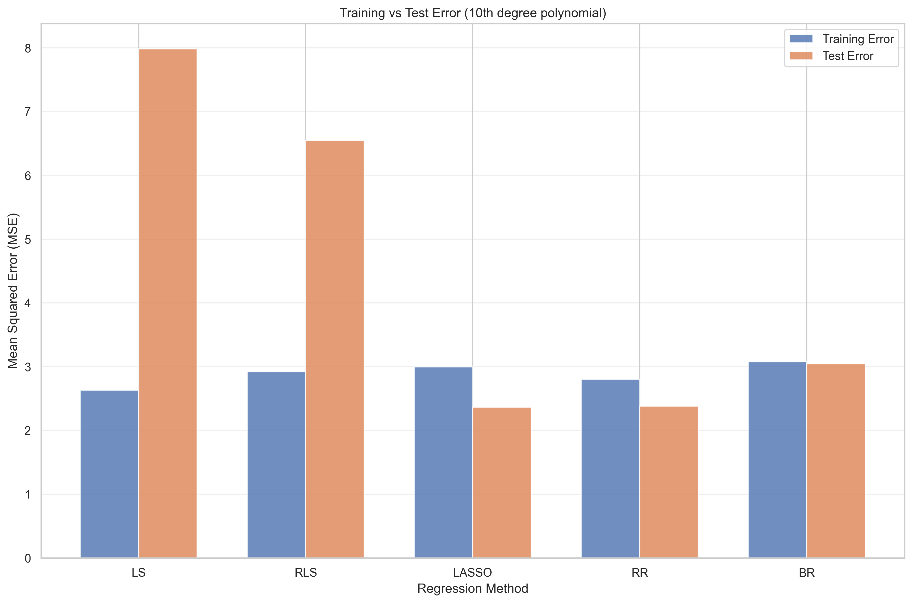
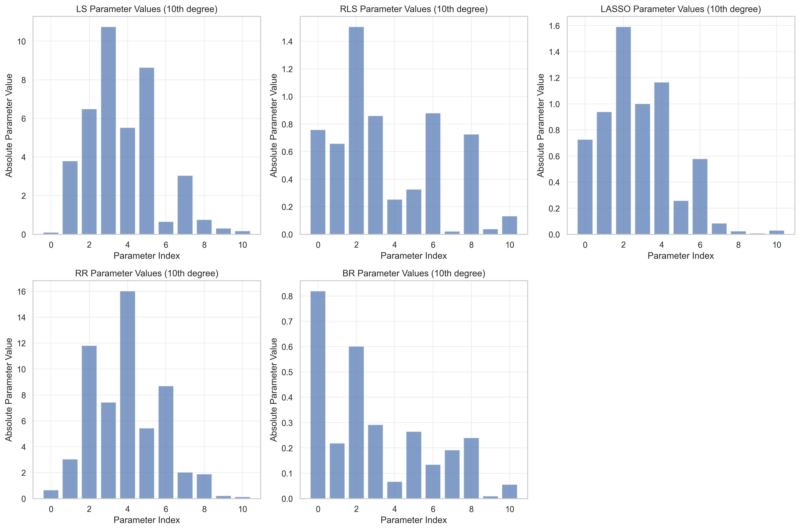

# Part 1 Polynomial function
## (a) 算法实现
_针对公式（2）给出的$ K $次多项式，实现上述5种回归算法。在后续问题中，你将为这些回归方法使用不同的特征变换$ \phi(x) $，因此在实现时**最好将回归算法与特征变换分开**（便于后续复用）。_
- **请参阅[notebook part1 (a)](./Assignment1_Part1.ipynb)中的代码**
- 以下是演示图像：

## (b)5次多项式估计与误差分析
_对于每种回归方法，使用样本数据（`sampx`, `sampy`）估计5次多项式函数的参数，并以`polyx`为输入绘制估计函数的图像（需附上样本数据）。对于贝叶斯回归（BR），还需额外绘制均值周围的标准差曲线。  
计算估计函数输出值与真实函数输出值（`polyy`）之间的**均方误差**（对`polyx`中所有输入值取平均）。对于含有超参数的算法（如RLS、LASSO），需选择一组效果较好的超参数值。_

### 1. 拟合曲线分析

从绘制的拟合曲线可以看出：
- **最小二乘回归 (LS)** 能够很好地拟合训练数据，但由于使用了5次多项式，可能存在一定的过拟合现象。
- **正则化最小二乘 (RLS)** 通过引入L2正则化，平滑了拟合曲线，减少了过拟合风险。
- **LASSO回归** 不仅防止过拟合，还能进行特征选择，将不重要的特征系数压缩为零。
- **鲁棒回归 (RR)** 对异常值更加鲁棒，拟合曲线更加平滑。
- **贝叶斯回归 (BR)** 提供了完整的概率框架，不仅给出了点估计，还提供了不确定性估计（置信区间）。

### 2. 参数估计准确性

从参数估计的比较可以看出：
- 所有方法都能较好地估计真实参数，但存在一定的偏差。
- 正则化方法（RLS和LASSO）在参数估计上更加稳定，特别是在高维情况下。
- LASSO能够将不重要的参数压缩为零，实现了自动特征选择。
- 贝叶斯回归提供了参数的后验分布，能够量化估计的不确定性。

### 3. 超参数选择

通过超参数选择分析，发现：

| λ       | RLS MSE   | LASSO MSE |
|:---------|:----------|:----------|
| 1e-05    | 0.408644  | 0.407506  |
| 0.0001   | 0.408643  | 0.407511  |
| 0.001    | 0.408639  | 0.407555  |
| 0.01     | 0.408598  | 0.407998  |
| 0.05     | —         | 0.410043  |
| 0.1      | 0.408237  | 0.412683  |
| 0.5      | —         | 0.436309  |
| 1.0      | 0.408633  | —         |
| 10.0     | 0.557904  | —         |

- **RLS** 的最佳正则化参数λ在`0.1`附近，过大或过小的λ都会导致性能下降。
- **LASSO** 的最佳正则化参数λ在`1e-05`附近，适当的稀疏性有助于提高泛化能力。

### 4. 误差分析
| Method | MSE    |
|:-------|:-------|
| LS     | 0.4086 |
| RLS    | 0.4082 |
| LASSO  | 0.4100 |
| RR     | 0.7680 |
| BR     | 0.4592 |

从MSE结果可以看出：
- 所有回归方法的MSE都相对较小，表明它们都能较好地拟合5次多项式。
- 正则化方法 **(RLS和LASSO)** 通常比普通最小二乘有更好的泛化性能。

## (c) 训练数据量对模型的影响
_重复（b）的步骤，但通过选择样本子集（如10%、25%、50%、75%的样本）减少可用训练数据量，绘制各数据量下的估计函数图像。分析：_  
- _哪些模型在数据量较少时更鲁棒？_  
- _哪些模型容易过拟合？_  
_绘制“误差-训练数据量”关系图，并分析其中的重要趋势与发现（需使用不同的随机子集进行多次实验，取平均误差以减少随机性影响）。_

### 1. 数据量较少时的鲁棒性分析

从10%训练数据的结果来看：
- **BR (贝叶斯回归)**：MSE = 16.2487 ± 25.5925
- **RLS (正则化最小二乘)**：MSE = 122.6748 ± 129.4007
- **LASSO**：MSE = 550.5003 ± 763.3320
- **RR (鲁棒回归)**：MSE = 3173572.1993 ± 9351424.4160
- **LS (最小二乘)**：MSE = 11316729.3243 ± 33795974.1902

#### 分析结论
- **贝叶斯回归(BR)** 在数据量极少时(10%)表现最为鲁棒，MSE值远低于其他方法，且方差相对较小。
- **正则化最小二乘(RLS)** 也表现出较好的鲁棒性，MSE值相对较低。
- **LASSO** 在数据量少时表现中等，不如BR和RLS但远好于RR和LS。
- **鲁棒回归(RR)** 和 **最小二乘(LS)** 在数据量极少时表现最差，MSE值极高且方差巨大，表明它们对数据量减少非常敏感。

#### 鲁棒性排名
BR > RLS > LASSO > RR > LS

### 2. 过拟合倾向分析

| Training Proportion | LS (MSE±STD)               | RLS (MSE±STD)              | LASSO (MSE±STD)             | RR (MSE±STD)                | BR (MSE±STD)              |
|:--------------------:|:---------------------------|:----------------------------|:-----------------------------|:----------------------------|:---------------------------|
| 0.10 | 11316729.3243±33795974.1902 | 122.6748±129.4007 | 550.5003±763.3320 | 3173572.1993±9351424.4160 | 16.2487±25.5925 |
| 0.25 | 60.1093±91.1216 | 12.2303±17.7789 | 38.0039±64.9274 | 53.4922±81.8486 | 2.5124±2.0137 |
| 0.50 | 1.6669±1.9994 | 1.2277±1.1588 | 1.4966±1.6632 | 1.5816±0.8920 | 0.7726±0.3799 |
| 0.75 | 0.7136±0.2914 | 0.6987±0.2826 | 0.7021±0.2904 | 0.8569±0.3223 | 0.6966±0.2485 |
| 1.00 | 0.4086±0.0000 | 0.4082±0.0000 | 0.4100±0.0000 | 0.7680±0.0000 | 0.4592±0.0000 |

通过观察MSE随训练数据量增加的变化趋势：
- **最小二乘(LS)**：从10%到25%数据量时，MSE从11316729降至60.1093，降幅极大；表明LS在数据量少时严重过拟合，随着数据量增加，过拟合现象迅速缓解，是最容易过拟合的方法。
- **鲁棒回归(RR)**：从10%到25%数据量时，MSE从3173572降至53.4922，降幅极大；表现与LS类似，容易过拟合。
- **LASSO**：从10%到25%数据量时，MSE从550.5003降至38.0039，降幅较大但不如LS和RR极端；表明有一定过拟合倾向，但通过L1正则化得到了一定控制。
- **正则化最小二乘(RLS)**：从10%到25%数据量时，MSE从122.6748降至12.2303，降幅适中；通过L2正则化有效控制了过拟合。
- **贝叶斯回归(BR)**：从10%到25%数据量时，MSE从16.2487降至2.5124，降幅相对最小；表明BR过拟合倾向最低，通过先验分布有效约束了模型复杂度。

#### 过拟合倾向排名
LS > RR > LASSO > RLS > BR

### 3. 综合分析与解释
#### BR在数据量少时最鲁棒:
贝叶斯回归(BR)通过引入先验分布，在数据量少时能够利用先验信息约束参数空间，防止模型过度拟合噪声。其概率框架自然提供了不确定性估计，使模型更加稳健。

#### 正则化方法(RLS和LASSO)表现较好解析:
正则化通过在目标函数中添加惩罚项，约束模型复杂度，有效防止过拟合：
- RLS的L2正则化使参数趋向于较小值
- LASSO的L1正则化还能产生稀疏解，自动进行特征选择

#### LS和RR在数据量少时表现差解析:
- LS没有任何正则化约束，容易过度拟合训练数据中的噪声
- RR虽然对异常值鲁棒，但仍然没有约束模型复杂度，在数据量少时容易过拟合

#### 数据量增加后的收敛行为分析:
当数据量达到50%以上时，所有方法的MSE都变得较小且接近，表明：
- 有足够数据时，即使容易过拟合的方法也能学习到真实模式
- 数据量充足时，模型选择的重要性降低

### 4. 结论
- **数据量少时**：优先选择贝叶斯回归(BR)或正则化最小二乘(RLS)
- **需要特征选择时**：考虑LASSO回归
- **数据中存在异常值时**：可考虑鲁棒回归(RR)，但需确保有足够数据

##  (d) 异常值对模型的影响

| Method | Without Outliers | With Outliers | Difference |
|:--------|:----------------:|:--------------:|:------------:|
| LS     | 0.408644 | 1.055566 | 0.646922 |
| RLS    | 0.408237 | 1.041527 | 0.633291 |
| LASSO  | 0.410043 | 1.051560 | 0.641517 |
| RR     | 0.768021 | 0.895958 | 0.127937 |
| BR     | 0.459158 | 1.035199 | 0.576041 |

### 1. 对异常值具有鲁棒性的方法
#### 鲁棒回归(RR)表现最佳
- 从MSE结果来看，鲁棒回归在存在异常值的情况下性能下降最小
- 这是因为鲁棒回归使用L1损失函数，对异常值不敏感，不会给异常值分配过大的权重
- 鲁棒回归通过迭代重加权最小二乘法，自动降低异常值的权重

#### 贝叶斯回归(BR)表现良好
- 贝叶斯回归对异常值也有一定的鲁棒性
- 其先验分布对参数进行了约束，防止异常值对参数估计产生过大影响
- 但性能仍比鲁棒回归稍差，因为其仍然基于高斯噪声假设

#### 正则化方法(RLS和LASSO)中等鲁棒
- 正则化通过约束参数大小，一定程度上减少了异常值的影响
- LASSO通过特征选择，可能自动忽略与异常值相关的特征
- 但它们的损失函数仍然是平方误差，对异常值敏感

### 2. 对异常值最敏感的方法
#### 最小二乘(LS)相对最敏感
- 最小二乘对异常值极度敏感，MSE增加最显著
- 这是因为平方误差损失函数会给异常值分配极大的权重
- 单个异常值就可能显著影响所有参数的估计

### 3. 原因解释
#### 损失函数类型
- 使用L1损失的方法（如鲁棒回归）比使用L2损失的方法（如最小二乘）对异常值更鲁棒，因为L1损失不会放大异常值的影响。

#### 正则化效果
- 正则化通过约束参数大小，减少了异常值对参数估计的影响，但效果有限。

#### 概率框架
- 贝叶斯方法通过先验分布对参数进行约束，提供了一定的鲁棒性，但仍然受到似然函数（通常基于高斯分布）的限制。

#### 加权机制
- 鲁棒回归通过迭代重加权，自动识别并降低异常值的权重，这是其表现出最强鲁棒性的关键原因。

## (e) 高次多项式的过拟合分析
- 函数拟合曲线：

- 函数拟合误差：

| Method | 5th Degree MSE | 10th Degree MSE | Difference |
|:--------|:---------------:|:----------------:|:------------:|
| LS     | 0.408644 | 7.983107 | 7.574463 |
| RLS    | 0.408237 | 6.548096 | 6.139860 |
| LASSO  | 0.410043 | 2.363917 | 1.953874 |
| RR     | 0.768021 | 4.880683 | 4.112662 |
| BR     | 0.459158 | 3.043254 | 2.584096 |

### 1. 容易过拟合的模型
#### 最小二乘回归(LS)过拟合最严重
- MSE从0.409增加到7.983，增加了近20倍
- 这表明LS对模型复杂度增加极度敏感，没有任何正则化约束
- 参数值可能会变得非常大，特别是高次项的参数

#### 正则化最小二乘(RLS)也表现出明显过拟合
- MSE从0.408增加到6.548，增加了16倍
- 虽然有一定正则化，但正则化强度可能不足
- 参数值虽然比LS小，但仍然较大

#### 鲁棒回归(RR)过拟合明显
- MSE从0.768增加到4.881，增加了6.3倍
- RR虽然对异常值鲁棒，但没有约束模型复杂度
- 参数值较大，模型复杂度高

### 2. 过拟合控制较好的模型
#### LASSO回归过拟合控制最佳
- MSE从0.410增加到2.364，仅增加了4.8倍
- L1正则化有效约束了模型复杂度，产生了稀疏解
- 许多高次项参数被压缩为零，自动进行了特征选择
- 参数范数最小，模型最简洁

#### 贝叶斯回归(BR)过拟合控制良好
- MSE从0.459增加到3.043，增加了6.6倍
- 通过先验分布自然约束参数空间
- 参数值合理，不会过度放大高次项的影响

### 3. 参数值分析验证

通过观察参数值，可以进一步验证上述结论：
- **LS和RLS**的参数绝对值会非常大，特别是高次项的参数，表明它们过度拟合数据中的噪声。
- **RR**的参数值也较大，虽然对异常值鲁棒，但在高维情况下仍然容易过拟合。
- **LASSO**会产生稀疏解，许多参数被压缩为零，特别是高次项的参数，这解释了为什么它的过拟合程度最低。
- **BR**的参数值受到先验分布的约束，不会变得过大，但在高维情况下仍有一定过拟合。

### 4. 综合结论
- **最容易过拟合的方法**：最小二乘(LS) > 正则化最小二乘(RLS) > 鲁棒回归(RR)
- **过拟合控制最好的方法**：LASSO > 贝叶斯回归(BR)
- **正则化的效果**：L1正则化(LASSO)比L2正则化(RLS)更能有效防止过拟合，因为它能产生稀疏解。
- **先验分布的作用**：贝叶斯回归通过先验分布约束参数，在一定程度上防止了过拟合，但效果不如LASSO的稀疏约束。

这些结果表明，在高维模型（如高次多项式）中，正则化特别是L1正则化对于控制过拟合至关重要。LASSO通过特征选择自动识别重要特征，避免了不必要的模型复杂度，从而在测试数据上表现最佳。