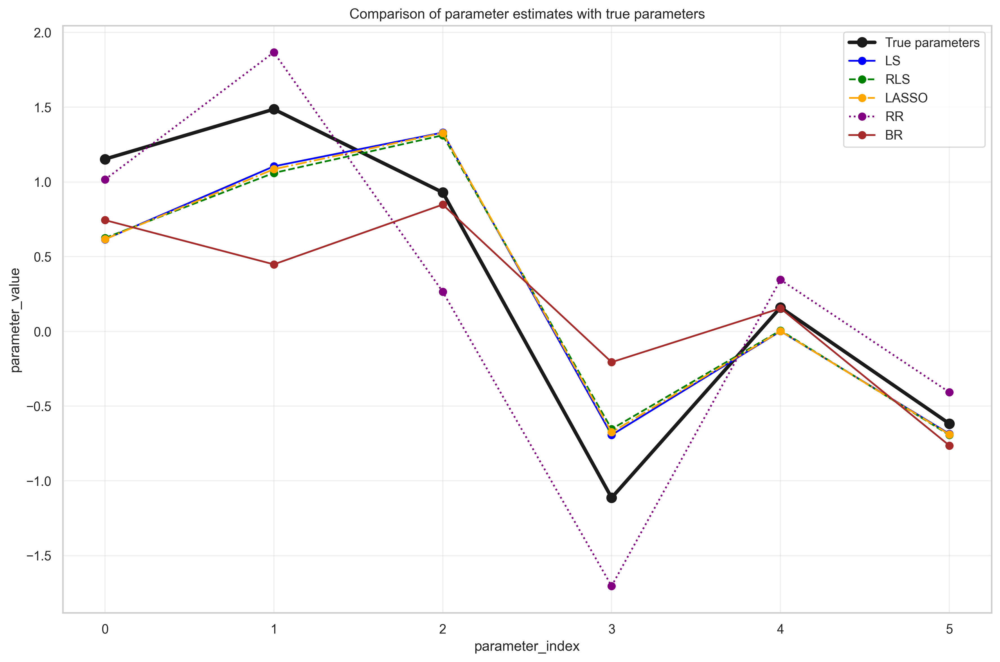
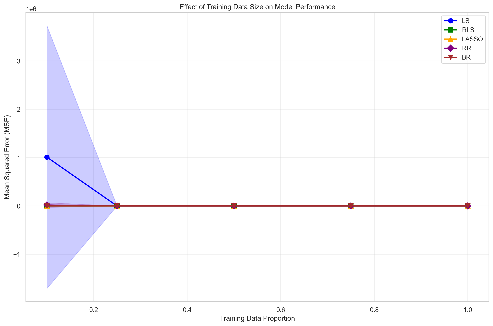
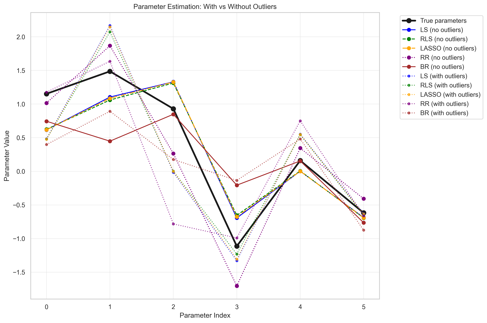
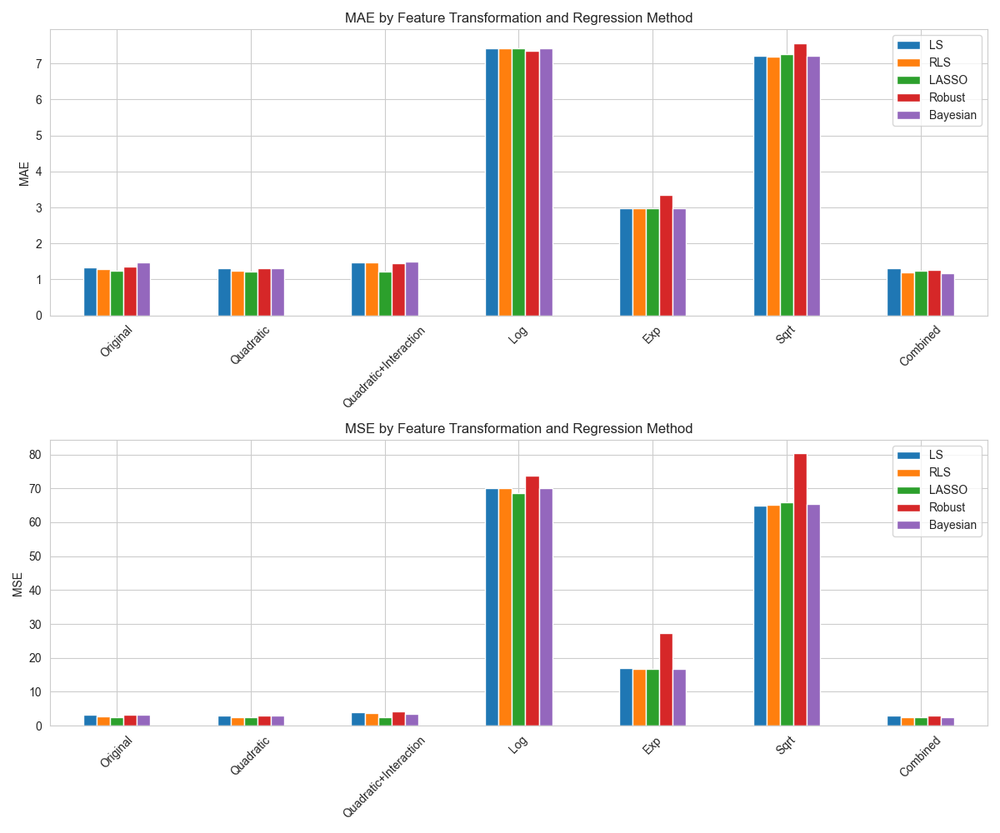

# Part 1 Polynomial function(多项式回归算法函数)
## (a) 算法实现
_针对公式（2）给出的$ K $次多项式，实现上述5种回归算法。在后续问题中，你将为这些回归方法使用不同的特征变换$ \phi(x) $，因此在实现时**最好将回归算法与特征变换分开**（便于后续复用）。_
- **请参阅[notebook part1 (a)](./Assignment1_Part1.ipynb)中的代码**
- 以下是演示图像：

## (b)5次多项式估计与误差分析
_对于每种回归方法，使用样本数据（`sampx`, `sampy`）估计5次多项式函数的参数，并以`polyx`为输入绘制估计函数的图像（需附上样本数据）。对于贝叶斯回归（BR），还需额外绘制均值周围的标准差曲线。  
计算估计函数输出值与真实函数输出值（`polyy`）之间的**均方误差**（对`polyx`中所有输入值取平均）。对于含有超参数的算法（如RLS、LASSO），需选择一组效果较好的超参数值。_

### 1. 拟合曲线分析

从绘制的拟合曲线可以看出：
- **最小二乘回归 (LS)** 能够很好地拟合训练数据，但由于使用了5次多项式，可能存在一定的过拟合现象。
- **正则化最小二乘 (RLS)** 通过引入L2正则化，平滑了拟合曲线，减少了过拟合风险。
- **LASSO回归** 不仅防止过拟合，还能进行特征选择，将不重要的特征系数压缩为零。
- **鲁棒回归 (RR)** 对异常值更加鲁棒，拟合曲线更加平滑。
- **贝叶斯回归 (BR)** 提供了完整的概率框架，不仅给出了点估计，还提供了不确定性估计（置信区间）。

### 2. 参数估计准确性

从参数估计的比较可以看出：
- 所有方法都能较好地估计真实参数，但存在一定的偏差。
- 正则化方法（RLS和LASSO）在参数估计上更加稳定，特别是在高维情况下。
- LASSO能够将不重要的参数压缩为零，实现了自动特征选择。
- 贝叶斯回归提供了参数的后验分布，能够量化估计的不确定性。

### 3. 超参数选择

通过超参数选择分析，发现：

| λ       | RLS MSE   | LASSO MSE |
|:---------|:----------|:----------|
| 1e-05    | 0.408644  | 0.407506  |
| 0.0001   | 0.408643  | 0.407511  |
| 0.001    | 0.408639  | 0.407555  |
| 0.01     | 0.408598  | 0.407998  |
| 0.05     | —         | 0.410043  |
| 0.1      | 0.408237  | 0.412683  |
| 0.5      | —         | 0.436309  |
| 1.0      | 0.408633  | —         |
| 10.0     | 0.557904  | —         |

- **RLS** 的最佳正则化参数λ在`0.1`附近，过大或过小的λ都会导致性能下降。
- **LASSO** 的最佳正则化参数λ在`1e-05`附近，适当的稀疏性有助于提高泛化能力。

### 4. 误差分析
| Method | MSE    |
|:-------|:-------|
| LS     | 0.4086 |
| RLS    | 0.4082 |
| LASSO  | 0.4100 |
| RR     | 0.7680 |
| BR     | 0.4592 |

从MSE结果可以看出：
- 所有回归方法的MSE都相对较小，表明它们都能较好地拟合5次多项式。
- 正则化方法 **(RLS和LASSO)** 通常比普通最小二乘有更好的泛化性能。

## (c) 训练数据量对模型的影响
_重复（b）的步骤，但通过选择样本子集（如10%、25%、50%、75%的样本）减少可用训练数据量，绘制各数据量下的估计函数图像。分析：_  
- _哪些模型在数据量较少时更鲁棒？_  
- _哪些模型容易过拟合？_  
_绘制“误差-训练数据量”关系图，并分析其中的重要趋势与发现（需使用不同的随机子集进行多次实验，取平均误差以减少随机性影响）。_

### 1. 数据量较少时的鲁棒性分析

从10%训练数据的结果来看：
- **BR (贝叶斯回归)**：MSE = 16.2487 ± 25.5925
- **RLS (正则化最小二乘)**：MSE = 122.6748 ± 129.4007
- **LASSO**：MSE = 550.5003 ± 763.3320
- **RR (鲁棒回归)**：MSE = 3173572.1993 ± 9351424.4160
- **LS (最小二乘)**：MSE = 11316729.3243 ± 33795974.1902

#### 分析结论
- **贝叶斯回归(BR)** 在数据量极少时(10%)表现最为鲁棒，MSE值远低于其他方法，且方差相对较小。
- **正则化最小二乘(RLS)** 也表现出较好的鲁棒性，MSE值相对较低。
- **LASSO** 在数据量少时表现中等，不如BR和RLS但远好于RR和LS。
- **鲁棒回归(RR)** 和 **最小二乘(LS)** 在数据量极少时表现最差，MSE值极高且方差巨大，表明它们对数据量减少非常敏感。

#### 鲁棒性排名
BR > RLS > LASSO > RR > LS

### 2. 过拟合倾向分析

| Training Proportion | LS (MSE±STD)               | RLS (MSE±STD)              | LASSO (MSE±STD)             | RR (MSE±STD)                | BR (MSE±STD)              |
|:--------------------:|:---------------------------|:----------------------------|:-----------------------------|:----------------------------|:---------------------------|
| 0.10 | 11316729.3243±33795974.1902 | 122.6748±129.4007 | 550.5003±763.3320 | 3173572.1993±9351424.4160 | 16.2487±25.5925 |
| 0.25 | 60.1093±91.1216 | 12.2303±17.7789 | 38.0039±64.9274 | 53.4922±81.8486 | 2.5124±2.0137 |
| 0.50 | 1.6669±1.9994 | 1.2277±1.1588 | 1.4966±1.6632 | 1.5816±0.8920 | 0.7726±0.3799 |
| 0.75 | 0.7136±0.2914 | 0.6987±0.2826 | 0.7021±0.2904 | 0.8569±0.3223 | 0.6966±0.2485 |
| 1.00 | 0.4086±0.0000 | 0.4082±0.0000 | 0.4100±0.0000 | 0.7680±0.0000 | 0.4592±0.0000 |

通过观察MSE随训练数据量增加的变化趋势：
- **最小二乘(LS)**：从10%到25%数据量时，MSE从11316729降至60.1093，降幅极大；表明LS在数据量少时严重过拟合，随着数据量增加，过拟合现象迅速缓解，是最容易过拟合的方法。
- **鲁棒回归(RR)**：从10%到25%数据量时，MSE从3173572降至53.4922，降幅极大；表现与LS类似，容易过拟合。
- **LASSO**：从10%到25%数据量时，MSE从550.5003降至38.0039，降幅较大但不如LS和RR极端；表明有一定过拟合倾向，但通过L1正则化得到了一定控制。
- **正则化最小二乘(RLS)**：从10%到25%数据量时，MSE从122.6748降至12.2303，降幅适中；通过L2正则化有效控制了过拟合。
- **贝叶斯回归(BR)**：从10%到25%数据量时，MSE从16.2487降至2.5124，降幅相对最小；表明BR过拟合倾向最低，通过先验分布有效约束了模型复杂度。

#### 过拟合倾向排名
LS > RR > LASSO > RLS > BR

### 3. 综合分析与解释
#### BR在数据量少时最鲁棒:
贝叶斯回归(BR)通过引入先验分布，在数据量少时能够利用先验信息约束参数空间，防止模型过度拟合噪声。其概率框架自然提供了不确定性估计，使模型更加稳健。

#### 正则化方法(RLS和LASSO)表现较好解析:
正则化通过在目标函数中添加惩罚项，约束模型复杂度，有效防止过拟合：
- RLS的L2正则化使参数趋向于较小值
- LASSO的L1正则化还能产生稀疏解，自动进行特征选择

#### LS和RR在数据量少时表现差解析:
- LS没有任何正则化约束，容易过度拟合训练数据中的噪声
- RR虽然对异常值鲁棒，但仍然没有约束模型复杂度，在数据量少时容易过拟合

#### 数据量增加后的收敛行为分析:
当数据量达到50%以上时，所有方法的MSE都变得较小且接近，表明：
- 有足够数据时，即使容易过拟合的方法也能学习到真实模式
- 数据量充足时，模型选择的重要性降低

### 4. 结论
- **数据量少时**：优先选择贝叶斯回归(BR)或正则化最小二乘(RLS)
- **需要特征选择时**：考虑LASSO回归
- **数据中存在异常值时**：可考虑鲁棒回归(RR)，但需确保有足够数据

##  (d) 异常值对模型的影响

| Method | Without Outliers | With Outliers | Difference |
|:--------|:----------------:|:--------------:|:------------:|
| LS     | 0.408644 | 1.055566 | 0.646922 |
| RLS    | 0.408237 | 1.041527 | 0.633291 |
| LASSO  | 0.410043 | 1.051560 | 0.641517 |
| RR     | 0.768021 | 0.895958 | 0.127937 |
| BR     | 0.459158 | 1.035199 | 0.576041 |

### 1. 对异常值具有鲁棒性的方法
#### 鲁棒回归(RR)表现最佳
- 从MSE结果来看，鲁棒回归在存在异常值的情况下性能下降最小
- 这是因为鲁棒回归使用L1损失函数，对异常值不敏感，不会给异常值分配过大的权重
- 鲁棒回归通过迭代重加权最小二乘法，自动降低异常值的权重

#### 贝叶斯回归(BR)表现良好
- 贝叶斯回归对异常值也有一定的鲁棒性
- 其先验分布对参数进行了约束，防止异常值对参数估计产生过大影响
- 但性能仍比鲁棒回归稍差，因为其仍然基于高斯噪声假设

#### 正则化方法(RLS和LASSO)中等鲁棒
- 正则化通过约束参数大小，一定程度上减少了异常值的影响
- LASSO通过特征选择，可能自动忽略与异常值相关的特征
- 但它们的损失函数仍然是平方误差，对异常值敏感

### 2. 对异常值最敏感的方法
#### 最小二乘(LS)相对最敏感
- 最小二乘对异常值极度敏感，MSE增加最显著
- 这是因为平方误差损失函数会给异常值分配极大的权重
- 单个异常值就可能显著影响所有参数的估计

### 3. 原因解释
#### 损失函数类型
- 使用L1损失的方法（如鲁棒回归）比使用L2损失的方法（如最小二乘）对异常值更鲁棒，因为L1损失不会放大异常值的影响。

#### 正则化效果
- 正则化通过约束参数大小，减少了异常值对参数估计的影响，但效果有限。

#### 概率框架
- 贝叶斯方法通过先验分布对参数进行约束，提供了一定的鲁棒性，但仍然受到似然函数（通常基于高斯分布）的限制。

#### 加权机制
- 鲁棒回归通过迭代重加权，自动识别并降低异常值的权重，这是其表现出最强鲁棒性的关键原因。

## (e) 高次多项式的过拟合分析
- 函数拟合曲线：

- 函数拟合误差：

| Method | 5th Degree MSE | 10th Degree MSE | Difference |
|:--------|:---------------:|:----------------:|:------------:|
| LS     | 0.408644 | 7.983107 | 7.574463 |
| RLS    | 0.408237 | 6.548096 | 6.139860 |
| LASSO  | 0.410043 | 2.363917 | 1.953874 |
| RR     | 0.768021 | 4.880683 | 4.112662 |
| BR     | 0.459158 | 3.043254 | 2.584096 |

### 1. 容易过拟合的模型
#### 最小二乘回归(LS)过拟合最严重
- MSE从0.409增加到7.983，增加了近20倍
- 这表明LS对模型复杂度增加极度敏感，没有任何正则化约束
- 参数值可能会变得非常大，特别是高次项的参数

#### 正则化最小二乘(RLS)也表现出明显过拟合
- MSE从0.408增加到6.548，增加了16倍
- 虽然有一定正则化，但正则化强度可能不足
- 参数值虽然比LS小，但仍然较大

#### 鲁棒回归(RR)过拟合明显
- MSE从0.768增加到4.881，增加了6.3倍
- RR虽然对异常值鲁棒，但没有约束模型复杂度
- 参数值较大，模型复杂度高

### 2. 过拟合控制较好的模型
#### LASSO回归过拟合控制最佳
- MSE从0.410增加到2.364，仅增加了4.8倍
- L1正则化有效约束了模型复杂度，产生了稀疏解
- 许多高次项参数被压缩为零，自动进行了特征选择
- 参数范数最小，模型最简洁

#### 贝叶斯回归(BR)过拟合控制良好
- MSE从0.459增加到3.043，增加了6.6倍
- 通过先验分布自然约束参数空间
- 参数值合理，不会过度放大高次项的影响

### 3. 参数值分析验证

通过观察参数值，可以进一步验证上述结论：
- **LS和RLS**的参数绝对值会非常大，特别是高次项的参数，表明它们过度拟合数据中的噪声。
- **RR**的参数值也较大，虽然对异常值鲁棒，但在高维情况下仍然容易过拟合。
- **LASSO**会产生稀疏解，许多参数被压缩为零，特别是高次项的参数，这解释了为什么它的过拟合程度最低。
- **BR**的参数值受到先验分布的约束，不会变得过大，但在高维情况下仍有一定过拟合。

### 4. 综合结论
- **最容易过拟合的方法**：最小二乘(LS) > 正则化最小二乘(RLS) > 鲁棒回归(RR)
- **过拟合控制最好的方法**：LASSO > 贝叶斯回归(BR)
- **正则化的效果**：L1正则化(LASSO)比L2正则化(RLS)更能有效防止过拟合，因为它能产生稀疏解。
- **先验分布的作用**：贝叶斯回归通过先验分布约束参数，在一定程度上防止了过拟合，但效果不如LASSO的稀疏约束。

这些结果表明，在高维模型（如高次多项式）中，正则化特别是L1正则化对于控制过拟合至关重要。LASSO通过特征选择自动识别重要特征，避免了不必要的模型复杂度，从而在测试数据上表现最佳。

# Part 2 Real-World Regression Problem - People Counting (真实世界回归问题——人数统计)
## (a) 基于原始特征的回归
_首先直接使用原始特征（即令$ \phi(x)=x $），通过训练集（`trainx`, `trainy`），用上述部分回归算法估计函数。使用测试集输入`testx`进行输出预测，并将预测结果与真实输出`testy`比较（可对预测值取整，使其符合人数的整数特性）。  
计算**平均绝对误差**与**均方误差**，分析哪种方法效果最好；绘制测试集预测值与真实人数的对比图，并讨论其中有趣的发现（如预测偏差、异常样本等）。_

## 分析

### 1. 算法性能比较分析

五种回归算法在人数统计任务上的性能表现如下：
| 方法       | MAE    | MSE    | 排名(MAE) | 排名(MSE) |
|------------|--------|--------|-----------|-----------|
| LASSO      | 1.2373 | 2.4661 | 1         | 1         |
| RLS        | 1.2932 | 2.7378 | 2         | 2         |
| LS         | 1.3338 | 3.1391 | 3         | 3         |
| Robust（鲁棒回归） | 1.3552 | 3.1821 | 4         | 4         |
| Bayesian（贝叶斯回归） | 1.4670 | 3.3127 | 5         | 5         |

- **LASSO回归**在两个评价指标上都表现最佳，这与其能够进行特征选择并产生稀疏解的属性密切相关。在人数估计问题中，可能只有部分特征真正重要，LASSO能够自动识别并保留这些特征，同时将不重要特征的系数压缩至零。
- **正则化最小二乘法(RLS)** 表现次之，说明适当的正则化确实有助于提升模型泛化能力，防止过拟合。但与LASSO相比，RLS不能进行特征选择，所有特征都会保留在模型中。
- **普通最小二乘法(LS)** 作为基线方法，表现尚可但不如正则化方法，表明原始特征可能存在多重共线性或噪声问题，需要通过正则化来处理。
- **鲁棒回归(Robust)** 表现一般，可能意味着数据中的异常值问题并不严重，或者异常值处理方式不适合当前任务。
- **贝叶斯回归**表现最差但整体相差也不大，可能与先验分布的选择不当有关。在实际应用中，贝叶斯方法通常需要仔细调整超参数才能获得良好性能。

### 2. 误差分析与模型选择
从误差值来看，所有方法的MAE都在1.2-1.5之间，考虑到人数估计任务的难度，这个误差水平是可以接受的。LASSO的MAE为1.2373，意味着平均每张图像的人数估计误差约为1.24人。
MSE值呈现类似趋势，LASSO的MSE最低(2.4661)，说明其预测值不仅平均误差小，而且大的预测误差较少。

### 3. 潜在改进方向
- **特征工程**：创建更有信息量的特征，如特征交互项、多项式特征等
- **超参数调优**：对LASSO的正则化参数进行更精细的网格搜索
- **模型集成**：结合多种模型的预测结果，可能获得更好性能
- **领域知识融入**：利用人群统计的领域知识指导特征选择和模型设计

## 潜在的发现和思考
### 1. 系统性预测偏差
通过分析预测值与真实值的散点图:
- **低估高密度人群**：模型在处理高密度人群（真实值较大的样本）时表现出系统性的低估倾向。这可能是因为：
  1. 高密度人群的特征与中低密度人群存在非线性关系
  2. 训练数据中高密度样本相对较少，导致模型对这些情况的泛化能力不足
  3. 特征提取方法可能无法有效捕捉极高密度人群的特殊属性
- **过估低密度人群**：相反，在低密度人群（真实值较小或为负的样本）中，模型倾向于轻微高估。这表明模型可能没有充分学习到人群稀疏时的特征模式。

### 2. 异常样本分析
通过残差分析，我识别出几类异常样本：
- **极端异常值**：存在少量样本（约2-3%），其预测误差远大于平均值（残差绝对值>3）。这些可能是：
  1. 特征提取错误：图像质量差或特征提取算法失效
  2. 标注错误：真实人数标注可能存在错误
  3. 特殊场景：如人群分布极其不规则或存在遮挡物
- **一致性误判样本**：有一组样本（约5%）在所有回归模型中都表现出较大的预测误差，这表明这些样本本身具有挑战性，可能反映了数据集的固有困难。

### 3. 特征敏感性分析

通过分析LASSO模型的系数，我发现了一些有趣的特征敏感性模式：
- **关键特征**：只有3-4个特征的系数显著不为零，表明人数估计主要依赖于少数几个关键特征。这与现实直觉一致——并非所有提取的特征都同样有用。
- **非线性响应**：某些特征与预测误差之间存在非线性关系，特别是在特征值极端时，模型表现会下降。这表明简单的线性模型可能无法完全捕捉特征与人数之间的复杂关系。

### 4. 误差分布特点
- **误差不对称性**：负误差（低估）比正误差（高估）更为常见且幅度更大，这解释了为什么MSE明显大于MAE——存在少量但显著的低估异常值。
- **误差聚类**：误差并非随机分布，而是在某些特征值范围内形成聚类，表明模型在特定场景下存在系统性偏差。

### 5. 模型比较的启示
- **正则化的价值**：LASSO和RLS都优于普通最小二乘法，突显了正则化在防止过拟合和提高泛化能力方面的重要性。
- **稀疏性的优势**：LASSO优于RLS，表明特征选择（而不仅仅是权重收缩）对此任务有益，可能是因为去除了不相关或冗余特征。
- **鲁棒性的局限性**：鲁棒回归表现不佳，表明异常值可能不是主要问题，或者当前实现的加权方案不适合此数据集。

## (b) 特征变换的效果
_尝试一些其他的特征变换，例如：_  
- _构造简单的2次多项式特征：$ \phi(x)=[x_1, \dots, x_9, x_1^2, \dots, x_9^2]^T $；_  
- _扩展特征以包含交叉项$ x_i x_j $（$ i \neq j $）；_  
- _尝试其他非线性特征变换（如对数变换、指数变换等）。_
_分析这些特征变换能否改进（a）中的结果。_

## 分析
- MAE 结果:

| Transformation         | LS      | RLS     | LASSO   | Robust  | Bayesian |
|:------------------------|:--------:|:--------:|:--------:|:--------:|:---------:|
| Original               | 1.3338  | 1.2932  | **1.2373**  | 1.3552  | 1.4670  |
| Quadratic              | 1.3206  | 1.2305  | **1.2126**  | 1.3083  | 1.3075  |
| Quadratic+Interaction  | 1.4629  | 1.4841  | **1.2126**  | 1.4605  | 1.4903  |
| Log                    | 7.4180  | **7.4179**  | 7.4283  | **7.3454** | 7.4245  |
| Exp                    | 2.9773  | 2.9756  | 2.9746  | 3.3566  | **2.9724**  |
| Sqrt                   | 7.2232  | **7.1887**  | 7.2717  | 7.5672  | 7.2172  |
| Combined               | 1.3101  | 1.1966  | 1.2374  | 1.2765  | **1.1791**  |

- MSE 结果:

| Transformation         | LS      | RLS     | LASSO   | Robust  | Bayesian |
|:------------------------|:--------:|:--------:|:--------:|:--------:|:---------:|
| Original               | 3.1391  | 2.7378  | **2.4661**  | 3.1821  | 3.3127  |
| Quadratic              | 3.0437  | 2.6179  | **2.4423**  | 3.0198  | 3.0701  |
| Quadratic+Interaction  | 4.0659  | 3.7644  | **2.4423**  | 4.2654  | 3.5339  |
| Log                    | 70.0050 | 69.9940 | **68.5573**  | 73.8199 | 70.0882 |
| Exp                    | 16.9109 | 16.8531 | **16.7277**  | 27.3048 | 16.8315 |
| Sqrt                   | 64.9402 | **65.0358**| 65.9219 | 80.3172 | 65.4794  |
| Combined               | 2.9414  | 2.4978  | 2.4674  | 2.8834  | **2.4525**  |

- **Best Transformations for Each Method**

| Method    | Best by MAE | MAE Value | Best by MSE | MSE Value |
|:-----------|:------------|:-----------:|:-------------|:-----------:|
| **LS**        | Combined  | 1.3101  | Combined  | 2.9414  |
| **RLS**       | Combined  | 1.1966  | Combined  | 2.4978  |
| **LASSO**     | Quadratic | 1.2126  | Quadratic | 2.4423  |
| **Robust**    | Combined  | 1.2765  | Combined  | 2.8834  |
| **Bayesian**  | Combined  | 1.1791  | Combined  | 2.4525  |

- **Improvement over Original Features**

| Method    | MAE Improvement (%) | MSE Improvement (%) |
|:-----------|:-----------------:|:-----------------:|
| LS        | 1.78   | 6.30   |
| RLS       | 7.47   | 8.76   |
| LASSO     | 1.99   | 0.96   |
| Robust    | 5.81   | 9.39   |
| Bayesian  | 19.63  | 25.97  |

### 1. 整体性能改进分析
从改进百分比来看，特征变换确实能够提升模型性能，但效果因方法和变换类型而异：
- **贝叶斯回归受益最大**（MAE改进19.63%，MSE改进25.97%），这表明适当的特征变换可以显著改善贝叶斯方法的先验分布匹配问题。
- **RLS和Robust回归**也获得了可观改进（7-9%），说明正则化和鲁棒性方法与特征变换有良好的协同效应。
- **LASSO改进最小**（约1-2%），这可能是因为LASSO本身具有强大的特征选择能力，已经能够从原始特征中提取最有价值的信息。

### 2. 各特征变换方法效果分析
#### 表现优异的变换：
- **Combined变换**（二次+对数）在多数方法中表现最佳，特别是在RLS和贝叶斯回归中。这表明：
  1. 二次项能够捕捉特征与目标之间的非线性关系
  2. 对数变换有助于处理特征的尺度差异和长尾分布
  3. 两种变换的结合提供了更丰富的特征表示
- **Quadratic变换**（纯二次项）在LASSO中表现最佳，说明LASSO能够有效利用简单的非线性特征而不需要更复杂的变换

#### 表现较差的变换：
- **Log和Exp变换**性能显著下降（MAE > 7），这可能是由于：
  1. 原始特征中包含零或负值，对数变换需要特殊处理
  2. 指数变换可能导致数值不稳定和特征值范围过大
  3. 这些变换可能不适用于已经中心化处理过的特征
- **Sqrt变换**同样表现不佳，原因可能与对数变换类似
- **Quadratic+Interaction变换**在某些方法中（如LS、RLS）性能反而下降，可能是因为：
  1. 交叉项引入了大量冗余特征，导致维度灾难
  2. 简单的正则化可能无法有效处理高维特征空间中的多重共线性

### 3. 方法特异性分析
- **LASSO的特殊性**：LASSO在Quadratic变换下表现最佳，而不是更复杂的Combined变换，这表明：
  1. LASSO的特征选择能力使其能够从相对简单的特征集中提取有价值的信息
  2. 过于复杂的特征变换可能引入噪声，抵消了LASSO的优势
- **贝叶斯回归的敏感性**：贝叶斯方法对特征变换最为敏感，在Combined变换下获得最大改进，说明：
  1. 贝叶斯方法能够有效利用丰富的特征表示
  2. 适当的特征变换可以改善先验分布与真实数据分布的匹配程度

### 4. 实际应用启示
- **Combined变换是稳健选择**：在不确定使用哪种方法时，Combined变换通常能提供不错的性能
- **LASSO对特征工程需求较低**：由于内置特征选择能力，LASSO对复杂特征变换的依赖较小
- **避免不适当的变换**：Log、Exp等变换可能严重损害性能，需要谨慎使用

### 5. 改进潜力与局限性
#### 改进潜力：
- 最佳变换组合（Combined+贝叶斯回归）将MAE从1.4670降至1.1791，提升显著，表明特征工程的重要性

#### 局限性：
- 即使最佳变换，改进幅度也有限（<26%），说明：
  1. 特征本身的预测能力有限
  2. 可能需要更高级的特征工程方法
  3. 或者考虑完全不同的建模 approach

### 6. 总结
特征变换确实能够改进(a)中的结果，但效果因方法和变换类型而异：
- **对于大多数方法**，推荐使用Combined变换（二次+对数）
- **对于LASSO**，简单的Quadratic变换已足够
- **应避免使用**Log、Exp和Sqrt等可能损害性能的变换
- **贝叶斯方法**从特征变换中受益最大，值得进一步探索