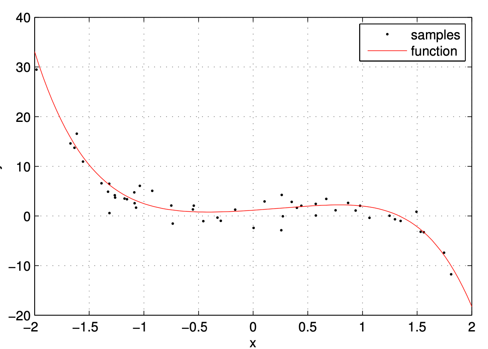

# CS5487 编程作业1：回归
安东尼·陈（Antoni Chan）  
香港城市大学计算机科学系

在本次编程作业中，你需要实现并测试课堂及习题集中介绍的部分回归方法。设$ f(x, \theta) $为一个函数，其输入为$ x \in \mathbb{R}^{d} $，参数为$ \theta \in \mathbb{R}^{D} $，且满足：  
$ f(x,\theta )=\phi (x)^{T}\theta \tag{1} $  
其中$ \phi(x): \mathbb{R}^{d} \to \mathbb{R}^{D} $是输入$ x $的**特征变换**。例如，输入$ x \in \mathbb{R} $的$ K $次多项式可表示为：  
$ f(x, \theta)=\sum_{k=0}^{K} x^{k} \theta_{k}=\phi(x)^{T} \theta $  
其特征变换与参数分别为：  
$ \phi(x)=\left[1, x, x^{2}, \cdots, x^{K}\right]^{T} \in \mathbb{R}^{K+1}, \theta=\left[\theta_{0}, \cdots, \theta_{K}\right]^{T} \in \mathbb{R}^{K+1} \tag{3} $  

给定独立同分布（iid）样本$ D=\{(x_{1}, y_{1}), \dots, (x_{n}, y_{n})\} $（其中$ y_{i} $是$ f(x_{i}, \theta) $的带噪声观测值），我们的目标是得到函数$ f(x, \theta) $的最优估计。为方便后续计算，定义如下变量：  
$ y=\left[y_{1}, \cdots, y_{n}\right]^{T}, \Phi=\left[\phi\left(x_{1}\right), \cdots, \phi\left(x_{n}\right)\right], X=\left[x_{1}, \cdots, x_{n}\right] \tag{4} $  

以下是目前我们已学习的各类回归算法总结：

| 方法                | 目标函数/分布                                                                 | 参数估计/后验分布                                                                 | 输入$ x_* $的预测值$ f_* $                                                          |
| ------------------- | ----------------------------------------------------------------------------- | --------------------------------------------------------------------------------- | ----------------------------------------------------------------------------------- |
| 最小二乘（LS）      | $ \left\|y-\Phi^{T} \theta\right\|^{2} $                                        | $ \hat{\theta}_{LS}=(\Phi \Phi^{T})^{-1} \Phi y $                                   | $ f_*=\phi(x_*)^{T} \hat{\theta} $                                                  |
| 正则化最小二乘（RLS）| $ \left\|y-\Phi^{T} \theta\right\|^{2}+\lambda\|\theta\|^{2} $                  | $ \hat{\theta}_{RLS}=(\Phi \Phi^{T}+\lambda I)^{-1} \Phi y $                         | $ f_*=\phi(x_*)^{T} \hat{\theta} $                                                  |
| L1正则化最小二乘（LASSO） | $ \left\|y-\Phi^{T} \theta\right\|^{2}+\lambda\|\theta\|_1 $                  | 二次规划求解器（参见习题3.13）                                                     | $ f_*=\phi(x_*)^{T} \hat{\theta} $                                                  |
| 鲁棒回归（RR）      | $ \left\|y-\Phi^{T} \theta\right\|_1 $                                          | 线性规划求解器（参见习题2.10）                                                     | $ f_*=\phi(x_*)^{T} \hat{\theta} $                                                  |
| 贝叶斯回归（BR）    | 分布： $ \theta \sim N(0, \alpha I) $ $ y \mid x, \theta \sim N(f(x, \theta), \sigma^{2}) $ | 后验分布： $ \theta \mid X, y \sim N(\hat{\mu}_{\theta}, \hat{\sigma}_{\theta}^{2}) $ $ \hat{\mu}_{\theta}=\frac{1}{\sigma^{2}} \hat{\Sigma}_{\theta} \Phi y $ $ \hat{\Sigma}_{\theta}=(\frac{1}{\alpha} I+\frac{1}{\sigma^{2}} \Phi \Phi^{T})^{-1} $ | 预测分布： $ f_* \mid X, y, x_* \sim N(\hat{\mu}_*, \hat{\sigma}_*^{2}) $ $ \hat{\mu}_*=\phi(x_*)^{T} \hat{\mu}_{\theta} $ $ \hat{\sigma}_*^{2}=\phi(x_*)^{T} \hat{\Sigma}_{\theta} \phi(x_*) $ |

## 第一部分 多项式函数
在本问题中，你将在一个简单数据集上测试上述回归方法，并分析不同目标函数、正则化项及模型形式对结果的影响。MATLAB数据文件`poly_data.mat`（若不使用MATLAB，可使用`poly_data *.txt`）包含一组由5次多项式生成的样本，观测噪声方差为$ \sigma^2=5 $。该文件包含以下变量：  
- `sampx`：样本输入值（即$ x_i $），每个元素对应一个输入值；  
- `sampy`：样本输出值（即$ y_i $），每个元素对应一个输出值；  
- `polyx`：真实函数的输入值（同时作为测试输入$ x_* $）；  
- `polyy`：真实函数的输出值；  
- `thtrue`：生成数据时使用的真实参数$ \theta $。  

样本（`sampx`, `sampy`）与真实多项式函数（`polyx`, `polyy`）的图像如下（原文附图略）：  
（图像横轴为$ x $，范围为$ -2 $至$ 2 $；纵轴为$ y $，范围为$ -20 $至$ 40 $，标注“samples”为样本点，“function”为真实函数曲线）  

本部分目标是通过样本估计该多项式函数，具体任务如下：

### (a) 算法实现
针对公式（2）给出的$ K $次多项式，实现上述5种回归算法。在后续问题中，你将为这些回归方法使用不同的特征变换$ \phi(x) $，因此在实现时**最好将回归算法与特征变换分开**（便于后续复用）。

### (b) 5次多项式估计与误差分析
对于每种回归方法，使用样本数据（`sampx`, `sampy`）估计5次多项式函数的参数，并以`polyx`为输入绘制估计函数的图像（需附上样本数据）。对于贝叶斯回归（BR），还需额外绘制均值周围的标准差曲线。  
计算估计函数输出值与真实函数输出值（`polyy`）之间的**均方误差**（对`polyx`中所有输入值取平均）。对于含有超参数的算法（如RLS、LASSO），需选择一组效果较好的超参数值。

### (c) 训练数据量对模型的影响
重复（b）的步骤，但通过选择样本子集（如10%、25%、50%、75%的样本）减少可用训练数据量，绘制各数据量下的估计函数图像。分析：  
- 哪些模型在数据量较少时更鲁棒？  
- 哪些模型容易过拟合？  
绘制“误差-训练数据量”关系图，并分析其中的重要趋势与发现（需使用不同的随机子集进行多次实验，取平均误差以减少随机性影响）。

### (d) 异常值对模型的影响
在输出值中添加一些异常值（例如，对`sampy`中的部分值加上一个较大的数），然后重复（b）的步骤。分析：  
- 哪些方法对异常值具有鲁棒性？  
- 哪些方法对异常值最敏感？  
并解释原因。

### (e) 高次多项式的过拟合分析
重复（b）的步骤，但估计更高次的多项式（例如10次多项式）。分析：  
- 在学习更复杂的模型时，哪些模型容易过拟合数据？哪些模型不会？  
通过观察估计的参数值（如参数的绝对值大小）验证你的结论。

## 第二部分 真实世界回归问题——人数统计
本部分将考虑一个真实世界的回归问题：**估计图像中的人数**。以下为一个包含人群的人行道图像示例（原文附图略）。  

从每张图像中，我们提取一个9维特征向量$ x_i \in \mathbb{R}^9 $，该向量基于人群的一些属性（例如，人群覆盖的面积、人群的周长等）；同时，我们还拥有每张图像对应的实际人数$ y_i \in \mathbb{R} $。本部分目标是学习特征向量与人数之间的回归函数（暂不考虑人数为非负整数的特性，直接应用标准回归方法）。  

数据存储在MATLAB文件`count_data.mat`中（若不使用MATLAB，可使用`count_data *.txt`），包含以下变量：  
- `trainx`：训练输入，每一列是一个9维特征向量；  
- `trainy`：训练输出，即每个输入向量对应的“去均值人数”（已减去所有样本的人数均值，因此会出现负的输出值）；  
- `testx`：测试输入；  
- `testy`：测试输入对应的真实输出。  

### (a) 基于原始特征的回归
首先直接使用原始特征（即令$ \phi(x)=x $），通过训练集（`trainx`, `trainy`），用上述部分回归算法估计函数。使用测试集输入`testx`进行输出预测，并将预测结果与真实输出`testy`比较（可对预测值取整，使其符合人数的整数特性）。  
计算**平均绝对误差**与**均方误差**，分析哪种方法效果最好；绘制测试集预测值与真实人数的对比图，并讨论其中有趣的发现（如预测偏差、异常样本等）。

### (b) 特征变换的效果
尝试一些其他的特征变换，例如：  
- 构造简单的2次多项式特征：$ \phi(x)=[x_1, \dots, x_9, x_1^2, \dots, x_9^2]^T $；  
- 扩展特征以包含交叉项$ x_i x_j $（$ i \neq j $）；  
- 尝试其他非线性特征变换（如对数变换、指数变换等）。  

分析这些特征变换能否改进（a）中的结果。

## 第三部分 超参数估计（选做）
截至目前，你可能通过“手动调整超参数（如$ \lambda $）并选择测试集上效果最好的值”来优化模型，但这种方式并不公平——它本质上是“针对测试集优化”，无法反映模型对未见过数据的泛化能力（真实场景中无法获取测试集的真实输出）。以下是两种仅使用训练集选择超参数的常用方法：

### 1. N折交叉验证（N-fold Cross-Validation）
该方法将原始训练集划分为“新训练集”与“验证集”，基于新训练集估计回归函数并在验证集上测试（针对不同超参数值重复此过程），最终选择验证集误差最小的超参数。具体步骤如下：  
1. 将训练集$ D $划分为$ N $个等大小的子集$ D_1, D_2, \dots, D_N $；  
2. 对每个子集$ D_i $和每个候选超参数$ \lambda_j $：  
   - 基于$ D \setminus D_i $（即除$ D_i $外的所有训练数据），使用$ \lambda_j $训练回归函数；  
   - 在$ D_i $上测试该函数，记录误差$ e_{i,j} $；  
3. 对每个超参数$ \lambda_j $，计算其在所有子集上的总误差$ E_j = \sum_{i=1}^N e_{i,j} $；  
4. 选择总误差最小的$ \lambda_j $，并使用完整的训练集$ D $训练最终的回归函数。  

（通常根据训练集大小选择3折至10折交叉验证，数据量较小时可选择更多折数以充分利用数据）

### 2. 最大边缘似然（Maximum Marginal Likelihood）
对于贝叶斯回归，可通过最大化训练数据的**边缘似然**来选择超参数（详见习题3.12）。超参数估计公式为：  
$ {\hat{\alpha}}, {\hat{\sigma}}^2 = \underset{\alpha, \sigma^2}{\text{argmax}} \, p(y \mid X, \sigma^2, \alpha) = \underset{\alpha, \sigma^2}{\text{argmax}} \log p(y \mid X, \sigma^2, \alpha) \tag{5} $  

其中，边缘对数似然的计算公式为：  
$
\begin{aligned}
\log p(y \mid X, \sigma^2, \alpha) &= \log \int p(y \mid \theta, X, \sigma^2) p(\theta \mid \alpha) d\theta \\
&= -\frac{D}{2}\log \alpha - \frac{n}{2}\log \sigma^2 - \frac{1}{2\sigma^2}\left\| y - \Phi^T \hat{\mu}_{\theta} \right\|^2 - \frac{1}{2\alpha}\left\| \hat{\mu}_{\theta} \right\|^2 - \frac{1}{2}\log \left| \hat{\Sigma}_{\theta}^{-1} \right| - \frac{n}{2}\log (2\pi)
\end{aligned}
$  

（注：原文中边缘对数似然公式存在重复项$ -\frac{1}{2\alpha}\left\| \hat{\mu}_{\theta} \right\|^2 $，此处保留原文形式）  

超参数选择步骤：对每个候选超参数对$ (\alpha_j, \sigma_j^2) $，计算上述边缘对数似然，选择使边缘似然最大的超参数对。

### (a) 超参数自动选择的效果
针对第二部分的人数统计问题，仅使用训练数据，通过交叉验证或最大边缘似然选择超参数。分析：  
- 与手动选择超参数相比，自动选择的超参数是否提高或降低了模型准确率？  
- 自动选择的超参数与你手动选择的超参数接近程度如何？

## 提交要求
你需提交以下材料：  
1. 上述所有问题的答案、图像、分析与讨论；  
2. 源代码文件。

## 抄袭说明
- 需使用**自己的代码**实现每种回归算法，不得使用他人实现的回归算法（包括MATLAB自带的回归函数，如`lsqcurvefit`、`lasso`等）；  
- 可使用常用的库组件与函数，例如：  
  - 标准矩阵运算（如`inv`求逆、`eig`求特征值）；  
  - 通用优化工具箱（如`quadprog`二次规划求解器、`linprog`线性规划求解器）；  
- 若使用了特殊的工具箱或库，务必在报告中注明。

## 评分标准
本作业的分数分布如下：  
- 10%：回归算法实现（第一部分(a)）；  
- 40%：回归函数测试结果（第一部分(b)(c)(d)(e)）；  
- 20%：人数统计问题结果（第二部分(a)）；  
- 10%：人数统计问题的特征变换尝试（第二部分(b)）；  
- 20%：书面报告质量（观察深刻、分析透彻者将获得更高分数）。  

**注**：若确实无法正确实现算法，可使用第三方软件获取结果。此时无法获得“算法实现”部分的分数，但仍可通过呈现结果、分析结论获得其他部分的分数。

## 选做问题说明
第三部分“超参数估计”为选做内容，不参与评分。