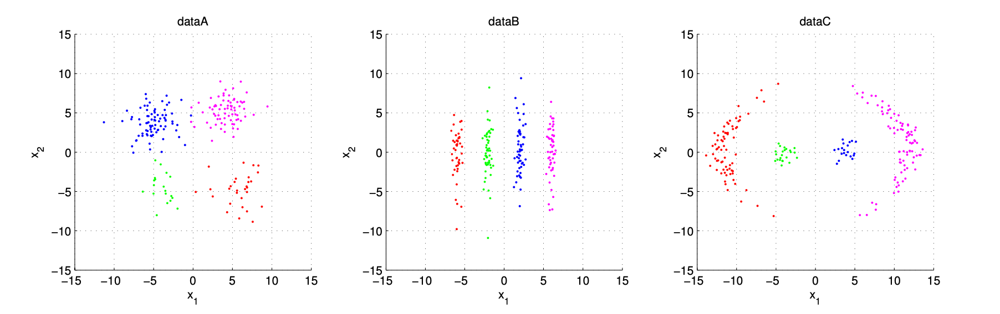
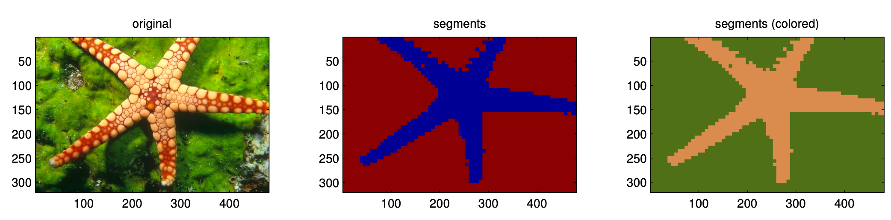
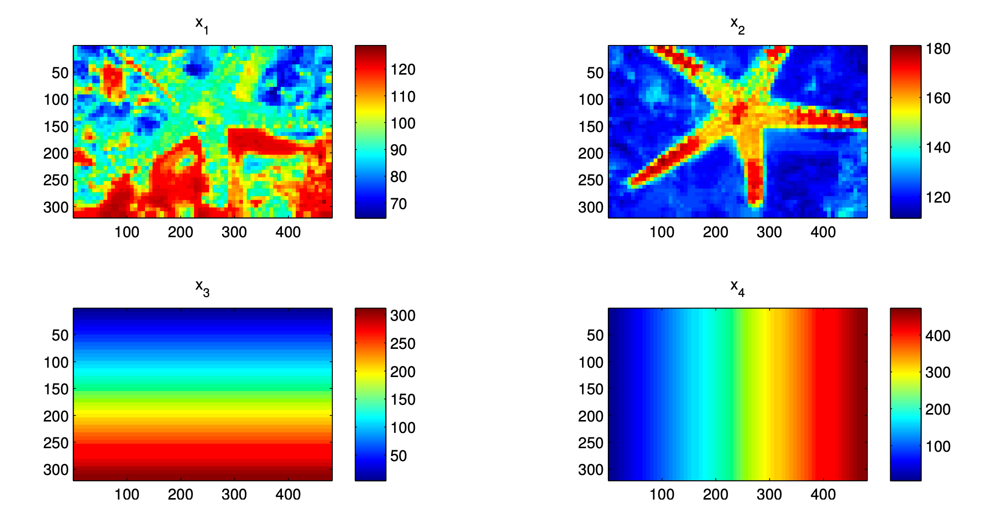

# CS5487 编程作业2：聚类
安东尼·陈  
香港城市大学计算机科学系  

本次编程作业要求你实现并测试多种聚类算法，分别应用于合成数据与真实数据。给定数据集 \(X = \{x_1, \cdots, x_n\}\)（其中 \(x_i \in \mathbb{R}^d\)），任务目标是为每个数据点分配聚类标签 \(y_i \in \{1, \cdots, K\}\)，其中 \(K\) 为聚类数量。本次作业需研究以下三种聚类算法：


## 1. K-means算法
K-means算法通过当前各数据点的聚类分配结果计算聚类中心 \(\mu_j\)（假设聚类数量 \(K\) 已知）。每次迭代包含以下两个步骤：  

**聚类分配**：  
\[z_{ij}= \begin{cases}1, & j=\arg\min_{k \in\{1, \cdots, K\}}\left\| x_i - \mu_k \right\|^2 \\ 0, & \text{其他情况}\end{cases}\]  

**中心估计**：  
\[ \mu_j = \frac{\sum_{i=1}^n z_{ij} x_i}{\sum_{i=1}^n z_{ij}} \tag{2}\]  

数据点 \(x_i\) 的聚类标签为其距离最近的聚类中心对应的标签，即 \(y_i = \arg\max_j z_{ij}\)。


## 2. 高斯混合模型的EM算法（EM-GMM）
EM算法用于估计包含 \(K\) 个成分的高斯混合模型（GMM）的极大似然参数，模型参数为 \(\{\pi_j, \mu_j, \Sigma_j\}_{j=1}^K\)（同样假设 \(K\) 已知）。算法包含E步（期望步）和M步（最大化步）：  

**E步**：  
\[ \hat{z}_{ij} = p\left(z_i = j \mid x_i\right) = \frac{\pi_j \mathcal{N}\left(x_i \mid \mu_j, \Sigma_j\right)}{\sum_{k=1}^K \pi_k \mathcal{N}\left(x_i \mid \mu_k, \Sigma_k\right)} \tag{3}\]  

**M步**：  
\[ \hat{N}_j = \sum_{i=1}^n \hat{z}_{ij},\ \hat{\pi}_j = \frac{\hat{N}_j}{n},\ \hat{\mu}_j = \frac{1}{\hat{N}_j} \sum_{i=1}^n \hat{z}_{ij} x_i \tag{4}\]  
\[ \hat{\Sigma}_j = \frac{1}{\hat{N}_j} \sum_{i=1}^n \hat{z}_{ij} \left(x_i - \hat{\mu}_j\right) \left(x_i - \hat{\mu}_j\right)^T \]  

算法收敛后，数据点 \(x_i\) 的聚类标签为后验概率最大的成分对应的标签，即 \(y_i = \arg\max_j \hat{z}_{ij}\)。课程网站上提供的“gmm-tips”文档包含EM-GMM实现的实用建议。


## 3. 均值漂移算法（Mean-shift）
均值漂移算法采用带有自适应步长的梯度上升法，在数据集 \(X\) 的核密度估计中寻找局部峰值。本次作业使用带宽为 \(h\) 的高斯核。给定初始点 \(\hat{x}^{(0)}\)（上标表示迭代次数），算法更新规则如下：  

\[ \hat{x}^{(t+1)} = \frac{\sum_{i=1}^n x_i \mathcal{N}\left(x_i \mid \hat{x}^{(t)}, h^2 I\right)}{\sum_{i=1}^n \mathcal{N}\left(x_i \mid \hat{x}^{(t)}, h^2 I\right)} \tag{6}\]  

为完成聚类，需将每个数据点 \(x_i\) 作为初始点运行均值漂移算法。算法收敛后，收敛到同一局部峰值的数据点将被分配相同的聚类标签。此时，聚类数量 \(K\) 不固定（取决于所选带宽 \(h\)）。


---

# 问题1 合成数据聚类
在本问题中，你需在合成数据上测试上述三种聚类算法，并分析每种算法在不同数据分布下的表现。压缩文件PA2-cluster-data.zip包含合成数据文件，其中MATLAB数据文件cluster_data.mat（若不使用MATLAB，可使用cluster_data*.txt文件）包含三个数据集（数据点及真实标签），文件中的变量说明如下：  
- dataA_X：数据集A的样本点，每一列代表一个数据点 \(x_i \in \mathbb{R}^2\)  
- dataA_Y：数据集A的真实标签 \(\{y_i\}\)  
- dataB_X：数据集B的样本点  
- dataB_Y：数据集B的真实标签  
- dataC_X：数据集C的样本点  
- dataC_Y：数据集C的真实标签  

下图展示了三个数据集的分布，颜色代表数据点的真实标签。  


本问题目标是利用样本点 \(X\) 发现每个数据集中的聚类结构。  

### (a)
实现上述三种聚类算法。由于后续问题需复用这些算法，请尽量保证代码的通用性。  

### (b)
在三个合成数据集上运行三种算法。从定性角度分析，每种算法在各数据集上的表现如何？结合数据分布特点，评述每种算法的优势与局限性。  

### (c)
均值漂移算法对带宽参数 \(h\) 的敏感度如何？


---

# 问题2 真实场景聚类问题——图像分割
本问题将聚类应用于真实场景任务——图像分割。图像分割的目标是在图像中找到“同质区域”，这些区域通常对应物体或物体的组成部分。下图左侧为一幅测试图像，右侧为使用K-means算法得到的分割结果（右侧图像中，每个分割区域的颜色由该区域内的平均颜色决定）。  


进行图像分割时，首先需从图像的每个像素（或规则网格上的部分像素）中提取特征向量。具体而言，以每个像素为中心构建窗口，提取四维特征向量 \(x = [u, v, c_y, c_x]^T\)，其中：  
- \((u, v)\)：窗口内的平均色度值（不含亮度的颜色信息）；  
- \((c_x, c_y)\)：像素位置（窗口在x-y坐标系中的中心）。  

示例图像的特征值分布如下图所示（每个子图对应一个特征维度在整幅图像上的分布）。  

 

接下来，使用聚类算法对特征向量进行分组，并为每个像素分配对应的聚类标签，最终形成分割结果。  

压缩文件PA2-cluster-images.zip包含图像文件及MATLAB工具代码（用于提取特征、根据聚类标签生成分割图像），提供的MATLAB函数如下：  
- getfeatures.m：从图像中提取特征的MATLAB函数；  
- labels2segm.m：根据聚类标签生成分割图像的MATLAB函数；  
- colorsegm.m：生成色彩美观的分割图像的MATLAB函数。  

以下代码为生成上述分割图像的示例：  
```matlab
% 读取图像并查看
img = imread('images/12003.jpg'); 
subplot(1,3,1); imagesc(img); axis image;

% 提取特征（步长=7）
[X, L] = getfeatures(img, 7); 
XX = [X(1:2,:) ; X(3:4,:)/10]; % 对坐标特征进行降维缩放（见问题(b)）

% 运行K-means算法——此处使用MATLAB自带函数，你需自行实现！
[Y, C] = kmeans(XX', 2);

% 根据标签生成分割图像
segm = labels2segm(Y, L);
subplot(1,3,2); imagesc(segm); axis image;

% 为分割图像着色
csegm = colorsegm(segm, img); 
subplot(1,3,3); imagesc(csegm); axis image
```  

在MATLAB中，可通过“help getfeatures”等命令查看各函数的文档说明。  

对于Python用户，压缩文件PA2-cluster-python.zip包含上述演示代码及特征提取辅助函数的Python版本，该代码需依赖numpy、scipy、matplotlib和Image模块。此外，压缩文件PA2-cluster-imfeatures-txt.zip包含步长为7时提取的图像特征文本文件。  


### (a)
使用三种聚类算法对提供的部分图像进行分割。从定性角度分析，哪种算法的分割效果更好？聚类数量 \(K\) 或带宽 \(h\) 变化时，分割结果如何变化？哪种算法对参数变化的敏感度更低？评述观察到的算法特性与局限性。  


### (b)
特征向量 \(x\) 包含两种不同尺度的特征：色度值 \((u, v)\) 的取值范围为0-255，而像素位置 \((c_x, c_y)\) 的取值范围为0-512。EM-GMM算法可通过调整协方差矩阵适应不同特征的尺度差异，但K-means和均值漂移算法假设协方差矩阵为固定的各向同性矩阵。可通过以下方式修改这两种算法，以支持不同特征的尺度调整：  
- **K-means算法**：修改数据点到聚类中心 \(x'\) 的距离计算方式，对不同类型特征施加权重：  
  \[ d\left(x, x'\right) = \left\| \begin{bmatrix} u \\ v \end{bmatrix} - \begin{bmatrix} u' \\ v' \end{bmatrix} \right\|^2 + \lambda \left\| \begin{bmatrix} c_x \\ c_y \end{bmatrix} - \begin{bmatrix} c_x' \\ c_y' \end{bmatrix} \right\|^2 \tag{7}\]  
  其中 \(\lambda \geq 0\) 为权重控制参数。  

- **均值漂移算法**：修改核函数，对不同类型特征使用独立带宽：  
  \[ k(x, x') = \frac{1}{(2\pi)^2 h_p^2 h_c^2} \exp\left\{ -\frac{1}{2h_c^2} \left\| \begin{bmatrix} u \\ v \end{bmatrix} - \begin{bmatrix} u' \\ v' \end{bmatrix} \right\|^2 - \frac{1}{2h_p^2} \left\| \begin{bmatrix} c_x \\ c_y \end{bmatrix} - \begin{bmatrix} c_x' \\ c_y' \end{bmatrix} \right\|^2 \right\} \tag{8}\]  
  其中 \(h_c\) 为颜色特征的带宽，\(h_p\) 为像素位置特征的带宽。  

修改你的K-means和均值漂移算法实现，以支持不同特征的尺度调整（提示：修改公式(7)中的距离或公式(8)中的核函数，等价于对特征向量 \(x\) 的各维度进行适当缩放）。重新运行图像分割实验，分割效果是否有所提升？


---

# 问题3 聚类结果的定量评估（可选）
本可选问题要求你对问题1和问题2的聚类结果进行定量评估。考虑包含 \(n\) 个元素的集合 \(S = \{s_1, \cdots, s_n\}\)，以及该集合的两种划分方式 \(y = \{Y_1, \cdots, Y_R\}\) 和 \(Z = \{Z_1, \cdots, Z_C\}\)，其中 \(Y_i\) 为划分 \(y\) 中的子集，\(Z_i\) 为划分 \(Z\) 中的子集。  


## 兰德指数（Rand Index）
兰德指数用于定量衡量两种聚类划分结果的一致性。直观而言，兰德指数对应两种划分方式的“成对一致性概率”，即任意两个元素在“同属一个聚类”或“分属不同聚类”这两种判断上的一致概率。  

### 兰德指数的定义
定义以下统计量：  
- \(a\)：在划分 \(y\) 中同属一个子集，且在划分 \(Z\) 中也同属一个子集的元素对数量；  
- \(b\)：在划分 \(y\) 中分属不同子集，且在划分 \(Z\) 中也分属不同子集的元素对数量；  
- \(c\)：在划分 \(y\) 中同属一个子集，但在划分 \(Z\) 中分属不同子集的元素对数量；  
- \(d\)：在划分 \(y\) 中分属不同子集，但在划分 \(Z\) 中同属一个子集的元素对数量。  

则兰德指数为成对一致的元素对占总元素对的比例：  
\[ \text{Rand} = \frac{a + b}{a + b + c + d} = \frac{a + b}{\binom{n}{2}} \tag{9}\]  


### 基于列联表的高效计算
兰德指数可通过列联表高效计算，列联表结构如下：  

| 划分\类别 | \(Z_1\) | \(Z_2\) | \(\cdots\) | \(Z_C\) | 行和 |
|-----------|---------|---------|------------|---------|------|
| \(Y_1\)   | \(n_{11}\) | \(n_{12}\) | \(\cdots\) | \(n_{1C}\) | \(r_1\) |
| \(Y_2\)   | \(n_{21}\) | \(n_{22}\) | \(\cdots\) | \(n_{2C}\) | \(r_2\) |
| \(\vdots\) | \(\vdots\) | \(\vdots\) | \(\ddots\) | \(\vdots\) | \(\vdots\) |
| \(Y_R\)   | \(n_{R1}\) | \(n_{R2}\) | \(\cdots\) | \(n_{RC}\) | \(r_R\) |
| 列和       | \(c_1\) | \(c_2\) | \(\cdots\) | \(c_C\) | \(n\) |

其中，\(n_{ij}\) 表示同时属于 \(Y_i\)（划分 \(y\) 的子集）和 \(Z_j\)（划分 \(Z\) 的子集）的元素数量；\(c_j\) 为第 \(j\) 列的和，\(r_i\) 为第 \(i\) 行的和。利用列联表，公式(9)中分子（一致的元素对数量）可通过以下公式计算：  
\[ a + b = \binom{n}{2} + \sum_{i=1}^R \sum_{j=1}^C n_{ij}^2 - \frac{1}{2} \left( \sum_{i=1}^R r_i^2 + \sum_{j=1}^C c_j^2 \right) \]  


### (a)
针对问题1：使用兰德指数评估你的聚类结果与真实标签的一致性。哪种算法的整体表现最佳？每种算法在单个数据集上的表现如何？超参数（\(K\) 或 \(h\)）变化时，结果如何变化？（例如，绘制参数-兰德指数曲线）  

### (b)
针对问题2：图像的真实分割结果存储在压缩文件的“gtruth”目录中，文件名格式为“<图像名>-<用户ID>.png”，其中<图像名>为原始图像文件名，<用户ID>为标注真实分割结果的人员ID。在真实分割图像中，每个灰度值对应一个分割区域——注意，灰度值在0-255范围内均匀分布（以便查看），你可能需要将其重新映射为1-\(K\) 的标签。使用兰德指数评估你的分割结果：哪种算法的图像分割效果最佳？超参数（\(K\) 或 \(h\)）变化时，结果如何变化？（例如，绘制参数-兰德指数曲线）  


## 兰德指数参考资料
- W. M. Rand. “Objective criteria for the evaluation of clustering methods”. *Journal of the American Statistical Association*, 66 (336): 846-850, 1971.  
- Lawrence Hubert and Phipps Arabie. “Comparing partitions”. *Journal of Classification*, 2 (1): 193-218, 1985.  


---

# 提交要求
你需提交以下材料：  
1. 上述所有问题的答案、图表、分析与讨论等；  
2. 源代码文件。  

请通过Canvas网站提交作业：进入“Assignments”→“Programming Assignment 2”提交。  


# 抄袭说明
你必须使用自己的代码实现每种聚类算法，不得使用他人编写的聚类算法实现（包括MATLAB自带的聚类函数）。使用通用的库组件和函数（如标准矩阵运算函数inv、eig等）是允许的。若使用特殊工具箱或库，请在报告中注明。  


# 评分标准
本次作业的分数分布如下：  
- 20%——K-means、EM和均值漂移算法的实现（问题1(a)）；  
- 20%——合成数据集上的实验结果（问题1(b)）；  
- 10%——算法对参数的敏感度分析（问题1(c)）；  
- 20%——图像分割结果及参数敏感度分析（问题2(a)）；  
- 10%——特征尺度调整后的实验结果（问题2(b)）；  
- 20%——实验报告质量（见解深刻的观察与分析可获得更高分数）。  

注：若确实无法正确实现算法，可使用第三方软件，但将无法获得“算法实现”部分的分数，其余部分（如结果展示）仍可得分。若使用第三方实现，必须在报告中注明来源。  


# 可选问题说明
可选问题3（聚类定量评估）不计分。