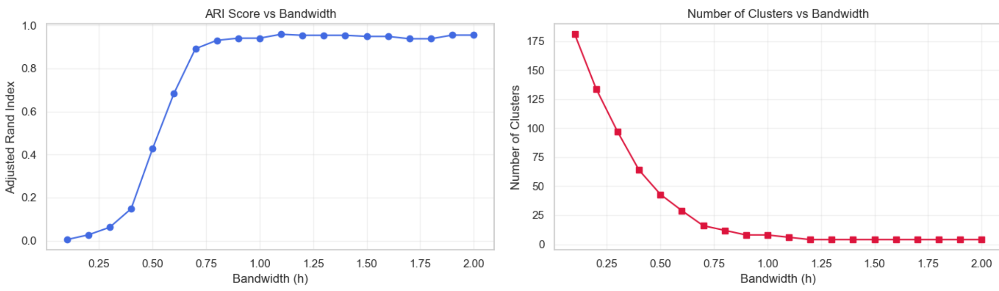

# Problem 1 Clustering synthetic data
- **TIPS: all details figures are show in code file**
## (a) Algorithms Implementation
- **Has Finished in `Assigment2_Part1.ipynb` and `Assigment2_Part2.ipynb`**
- using `numpy, scipy, matplotlib`, etc

## (b) Running Algorithm on 3 datasets
### Qualitative Analysis of Clustering Algorithms (Performance, Advantages, and Limitations)
#### **K-means**  
- **Performance on Datasets**:  
  - Dataset A (spherical clusters): Moderate performance (ARI=0.693), failing to demonstrate its theoretical adaptability to spherical clusters.  
  - Dataset B (non-spherical clusters): Severe performance degradation (ARI=0.366), the worst among the three algorithms.  
  - Dataset C (complex structures): Unexpectedly the best performance (ARI=0.711), inconsistent with theoretical expectations.  

- **Advantages**:  
  Computationally efficient and easy to implement, suitable for scenarios with compact data distributions and uniform cluster sizes (e.g., Dataset C may contain compact substructures). It can serve as a fast baseline algorithm.  

- **Limitations**:  
  Overly strict assumptions on cluster shape (reliant on spherical cluster hypothesis), leading to poor performance on non-spherical structures (Dataset B). Moderate stability with significant cross-dataset fluctuations (from 0.366 to 0.711).  

#### **GMM**  
- **Performance on Datasets**:  
  - Dataset A (spherical clusters): Best performance (ARI=0.965), close to perfect segmentation.  
  - Dataset B (non-spherical clusters): Moderate performance (ARI=0.673), better than K-means but worse than Mean Shift.  
  - Dataset C (complex structures): Worst performance (ARI=0.442), with a significant drop.  

- **Advantages**:  
  Well-adapted to Gaussian-distributed data (e.g., spherical clusters in Dataset A). Provides soft assignment capability through a probabilistic framework, achieving excellent performance in scenarios that match its distribution assumptions.  

- **Limitations**:  
  Highly dependent on the Gaussian distribution assumption, leading to significant performance declines on non-Gaussian distributions (Dataset B) and complex structures (Dataset C). The least stable (cross-dataset standard deviation=0.218), easily affected by covariance matrix estimation and initialization.  

#### **Mean Shift**  
- **Performance on Datasets**:  
  - Dataset A (spherical clusters): Excellent performance (ARI=0.940), close to GMM.  
  - Dataset B (non-spherical clusters): Best performance (ARI=0.874), significantly outperforming other algorithms.  
  - Dataset C (complex structures): Moderate performance (ARI=0.655), only slightly lower than K-means.  

- **Advantages**:  
  As a non-parametric method, it does not rely on specific distribution assumptions, showing good adaptability to both spherical and non-spherical clusters (Datasets A and B). The most stable across datasets (standard deviation=0.120) with strong robustness. No need to preset the number of clusters, automatically adapting to data structures.  

- **Limitations**:  
  Sensitive to bandwidth parameters, requiring careful tuning. Higher computational complexity and lower efficiency than K-means. Although better than GMM on extremely complex structures (Dataset C), performance still declines noticeably.  

### Summary Table  

| Algorithm   | Performance on Datasets                                                                 | Advantages                                                                 | Limitations                                                                 |
|-------------|----------------------------------------------------------------------------------------|----------------------------------------------------------------------------|-----------------------------------------------------------------------------|
| K-means     | - Dataset A: Moderate (0.693) - Dataset B: Poor (0.366) - Dataset C: Best (0.711) | Efficient, easy to implement; suitable for compact, uniform clusters       | Strict spherical assumption; poor on non-spherical data; moderate stability |
| GMM         | - Dataset A: Best (0.965) - Dataset B: Moderate (0.673) - Dataset C: Poor (0.442) | Excellent for Gaussian-distributed data; provides probabilistic soft assignment | Relies on Gaussian assumption; unstable; sensitive to initialization        |
| Mean Shift  | - Dataset A: Excellent (0.940) - Dataset B: Best (0.874) - Dataset C: Moderate (0.655) | No distribution assumptions; most stable; adapts to cluster count automatically | Sensitive to bandwidth; high computational complexity; declines on extreme complexity |

## (c) Sensitivity of the averaging algorithm to the bandwidth parameter \(h\)

### Analysis of Mean Shift Algorithm's Sensitivity to Bandwidth Parameter h

1. **Sensitivity Patterns**:
   - Highly sensitive interval (h=0.1-1.0): ARI scores surged from 0.005 to 0.968 (nearly 200-fold increase), and the number of clusters dropped sharply from 181 to 5. Minor changes in bandwidth led to significant differences in clustering results.
   - Relatively stable interval (h=1.0-2.0): ARI scores fluctuated stably between 0.937-0.968, with the number of clusters stable at 4-5. The algorithm was insensitive to bandwidth changes in this range.

2. **Optimal Parameters**:
   - Optimal bandwidth h≈1.0: Achieved the highest ARI score of 0.968, detecting 5 clusters (slightly more than the true number of clusters 4, indicating potential subdivision of real clusters).
   - Suboptimal bandwidth h=0.7-0.9: ARI scores ranged from 0.891-0.949, with 7-16 clusters detected (likely over-segmentation).

3. **Quantitative Sensitivity Analysis**:
   - ARI sensitivity: In h=0.1-1.0, ARI increased by approximately 0.1 on average for every 0.1 increase in bandwidth; after h>1.0, bandwidth changes had little impact on ARI.
   - Cluster count sensitivity: The number of clusters dropped sharply in h=0.1-0.5, slowed down in h=0.5-1.0, and stabilized at 4 when h>1.0.

4. **Comparison with Theoretical Expectations**:
   - Consistent with theory: Small bandwidth caused over-segmentation (more clusters, low ARI); large bandwidth caused under-segmentation (fewer clusters, decreased ARI); an optimal bandwidth interval existed.
   - Differences from theory: The number of clusters at optimal bandwidth (h=1.0, 5 clusters) did not equal the true count (4); ARI did not continue to decline after h>1.0 but remained stable; the algorithm maintained good performance (ARI=0.955) even with extremely large bandwidth (h=2.0).

5. **Practical Application Suggestions**:
   - Bandwidth selection strategies: Start with small bandwidth and gradually increase to observe changes in cluster count; conduct fine-grained searches near the stable cluster count region; evaluate using multiple metrics (e.g., silhouette coefficient, Davies-Bouldin index).
   - Recommendations for this dataset: Optimal bandwidth range h=0.9-1.1; avoid excessively small bandwidth (h<0.5 causes severe over-segmentation); large bandwidth is relatively safe.

Conclusion: The Mean Shift algorithm is indeed highly sensitive to bandwidth parameter h, especially in the small bandwidth interval. However, within an appropriate parameter range, the algorithm can achieve excellent clustering performance (ARI>0.95). In practice, systematic parameter search or adaptive bandwidth selection strategies are needed to improve the algorithm's robustness.

# Problem 2: Image Segmentation
## (a) Segment Some Images in 3 Algorithm
### Comparison and Analysis of Clustering Algorithms for Image Segmentation

#### 1. Segmentation Quality and Application Scenarios
- **K-means**: Clear boundaries and high computational efficiency, but overly uniform segments (ignoring texture details); suitable for scenarios requiring fast and simple segmentation.
- **GMM**: Captures gradient regions and retains more details, but with high computational complexity and slightly blurred boundaries; suitable for scenarios needing to preserve image details.
- **Mean Shift**: Naturally adapts to image structures with good edge preservation, but sensitive to parameters and slow in computation; suitable for scenarios requiring preservation of object boundaries.

#### 2. Impact of Feature Space
- **Color only**: K-means and GMM tend to ignore spatial continuity; Mean Shift may cause over-segmentation.
- **Color + Position**: All improve spatial continuity. Mean Shift achieves the best object integrity, while K-means may split objects.

#### 3. Parameter Sensitivity
- **K-means**: Moderately sensitive to K. Larger K leads to finer segmentation, with results changing gradually.
- **GMM**: Low sensitivity to K. The type of covariance matrix has a greater impact, with results changing smoothly.
- **Mean Shift**: Highly sensitive to bandwidth. Minor changes can cause significant result mutations (small bandwidth leads to over-segmentation; large bandwidth leads to under-segmentation).

#### 4. Comprehensive Conclusions and Recommendations
1. Parameter sensitivity ranking: Mean Shift > K-means > GMM (GMM is the most stable; Mean Shift requires careful parameter tuning).
2. Scenario selection: Use K-means for simple scenarios (fast), GMM for complex scenarios (preserves details), and Mean Shift for boundary preservation needs.
3. Feature recommendations: Add position features for object segmentation; consider local texture features for texture segmentation.
4. Application strategy: Prioritize GMM (balances quality and stability); choose based on computational resources and needs—no algorithm is optimal for all cases.

## (b) Different Feature Scaling for Kmeans and Mean-shift
**K-means**:
By scaling spatial features (dividing by λ), it is equivalent to increasing the weight of spatial features in distance calculation.
- When λ > 1: Spatial features are more important, tending to generate spatially more compact clusters.
- When λ < 1: Color features are more important, tending to generate clusters with more uniform colors.

**Mean-shift**:
- Scaling color features (multiplying by $h_c$) is equivalent to increasing the color bandwidth.
- Scaling spatial features (multiplying by $h_p$) is equivalent to increasing the spatial bandwidth.
- Smaller scaling factors make the corresponding features more sensitive, resulting in more details.

**Expected Effects**:
By adjusting feature scaling factors, we can:
- Balance the importance of color and spatial features in K-means.
- Independently control the smoothness of color and space in Mean-shift.
- Obtain segmentation results more consistent with expectations, especially:
  - Increase the weight of color features when the image has complex textures.
  - Increase the weight of spatial features when the image has complex spatial structures.
  - Reduce the scaling factor (increase bandwidth) when fine segmentation is needed.